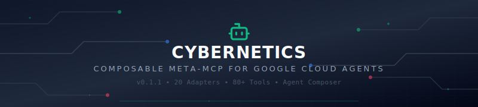

<div align="center">



</div>

<p align="center">
  <strong>Project Cybernetics: Composable Agentic Broker</strong><br/>
  <sub>v0.1.1  •  20 Adapters  •  80+ Tools  •  Agent Composer  •  A2A/ERC-8004 Ready</sub>
</p>

<p align="center">
  
  
  
  
  
  
</p>

<p align="center">
  
  
  
  
  
</p>

---
  
**Version:** 0.1.1  

### The Unified Control Plane for Enterprise AI Agents
Cybernetics is a production-ready, security-first Model Context Protocol (MCP) meta-broker. It aggregates 20+ specialized MCP adapters into a single, authenticated, auditable control plane, enabling autonomous agents to execute complex, multi-phase workflows across Google Cloud environments.

## 🚀 The Problem
Modern enterprise environments are fragmented. Developers and SREs struggle with "Agent sprawl"—needing to configure dozens of disconnected MCP servers, each with its own authentication, security overhead, and maintenance burden.

## 💡 The Solution
Cybernetics provides a single, unified entry point. By abstracting the MCP protocol into a composable registry, we allow agents to switch between tools (Dynatrace, GitHub, AWS, etc.) seamlessly.

## 🔑 Key Features

One Port to Rule Them All: Replace 20+ disconnected MCP configurations with a single secure connection.
Production-Hardened: Built with Zero Trust, non-root containers, and structured logging.
Agent Composer: Use our UI to visually compose agents and deploy them directly to Google Cloud Run.
Ready for Anything: Pre-built agent templates for SRE, CI/CD, FinOps, and Security.
Protocol Native: Fully compliant with A2A, A2P, and Google’s ERC-8004 identity standard.

## 🏗️ How It Works

Compose: Use the Web UI to pick a template (e.g., Sentinel for self-healing SRE).
Connect: Link your tools (GitHub, Slack, AWS) via the Cybernetics Broker.
Execute: Your agent orchestrates multi-phase workflows autonomously.

## 🛠️ Quick Start

1. As an MCP Server
Install and connect Cybernetics to your favorite AI platform (Claude Desktop, Cursor, etc.):

```Bash


pip install cybernetics-mcp
Configure your client with your BROKER_API_KEY and the specific adapter keys required for your workflow.
```

2. Via the Agent Composer Web UI
Start the broker to access the visual agent builder:
```
Bash


# Start the Go backend
go run cmd/composer/main.go

# Start the React frontend
cd frontend && npm install && npm run dev
```

## 🛡️ Security & Compliance

Cybernetics is designed for regulated environments (NIST 800-53, FedRAMP Moderate compliant):
Secret Management: Secrets are injected at runtime via Google Secret Manager.
Auditability: Every tool invocation is logged in structured JSON for Cloud Logging.
Defense in Depth: Includes circuit breakers, input sanitization, and strict environment isolation.

## 📊 Adapter Catalog

We currently support 20+ integrations:
- [ ] Infrastructure: AWS, Kubernetes, Cloudflare
- [ ] Monitoring/Logs: Dynatrace, Elastic, Datadog
- [ ] Development: GitHub, GitLab, Vercel
- [ ] Business Ops: Stripe, Slack, Notion, Linear, Supabase

🧑‍🤝‍🧑 Team Members

**Authors:** @plasmaraygun, @GoryGrey, @royhodge812, @sebuh-infsol  (strawberr0)  


📜 License

Licensed under the GNU Affero General Public License v3.0 (AGPL-3.0+).
