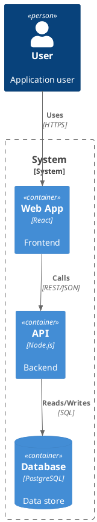

# Diagram Generation Rules

**Enforcement Level**: MEDIUM
**Scope**: All SDLC documentation artifacts
**Issue**: #430

## Overview

Diagram generation is a standard, expected output alongside every major documentation artifact — not an optional add-on. Every architecture doc, flow, system boundary, and process description should have a corresponding diagram.

## Required Diagram Types per Artifact

| Artifact | Required Diagrams | Recommended Tool |
|----------|-------------------|-----------------|
| SAD (System Architecture Doc) | C4 context + container diagrams, component diagram | PlantUML (C4) |
| ADR | Optional: decision tree or option comparison diagram | MermaidJS |
| Use Cases | Activity diagram or sequence diagram per major flow | MermaidJS |
| Data model | Entity-relationship diagram | MermaidJS |
| Deployment plan | Infrastructure topology diagram | MermaidJS |
| Threat model | Data flow diagram (DFD) with trust boundaries | MermaidJS |
| API design | Sequence diagrams for key request flows | MermaidJS |
| SDLC phase plans | Gantt or swimlane for timeline/ownership | MermaidJS |
| Onboarding docs | System overview diagram | MermaidJS |

## Tool Selection Guidance

### MermaidJS (Default)

Preferred for most diagram types due to native GitHub/Gitea markdown rendering:

- **Flowcharts** — process flows, decision trees
- **Sequence diagrams** — API flows, interaction patterns
- **ER diagrams** — data models, entity relationships
- **Gantt charts** — timelines, phase plans
- **State diagrams** — lifecycle states, transitions
- **Class diagrams** — simple component relationships

```markdown
```mermaid
graph TD
    A[Client] -->|HTTP| B[API Gateway]
    B --> C[Auth Service]
    B --> D[User Service]
    C --> E[(Database)]
    D --> E
``​`
```

### PlantUML

Preferred for formal architecture and UML diagrams:

- **C4 model** — context, container, component, code views
- **UML class diagrams** — detailed type hierarchies
- **UML component diagrams** — deployment architecture
- **UML deployment diagrams** — infrastructure topology

```markdown


## Visual Communication Principles

Every diagram should follow these principles:

1. **Show boundaries, not just boxes** — trust boundaries, system boundaries, network zones
2. **Label relationships, not just connections** — protocol, data type, direction
3. **Answer a specific question** — each diagram should answer one question a reader would have
4. **Accompany text** — diagrams supplement prose, they don't replace it
5. **Include source** — always commit diagram source alongside any rendered output so it can be updated

## Enforcement Rules

### Rule 1: Diagram Sections in Templates

All artifact templates that require diagrams (per the table above) MUST include a `## Diagrams` section with:
- Placeholder diagram code block (MermaidJS or PlantUML as appropriate)
- Comment indicating which diagram type belongs there
- Guidance text for the generating agent

### Rule 2: Missing Diagrams are Documentation Gaps

When `doc-sync` or any documentation audit skill runs, artifacts missing their required diagrams should be flagged as documentation gaps alongside missing text sections.

### Rule 3: Source Committed with Output

If rendered diagram images are generated (PNG, SVG), the source (`.mmd`, `.puml`, or inline code block) MUST be committed alongside them. Rendered-only diagrams without source are not maintainable.

### Rule 4: Diagram Complexity Limits

Individual diagrams should remain readable:
- **Max 15 nodes** per diagram — split into sub-diagrams if more complex
- **Max 3 levels of nesting** — flatten or decompose
- **Use consistent styling** — colors, shapes, and labels should follow project conventions

## Integration

This rule applies to all agents that generate documentation artifacts. Key integration points:

- **Architecture Designer** — SAD, ADRs, component diagrams
- **Requirements Analyst** — use case activity/sequence diagrams
- **Test Architect** — test flow diagrams
- **Security Architect** — threat model DFDs
- **Deployment Manager** — infrastructure topology

## References

- #430 — Elevate diagram generation to standard utility
- @$AIWG_ROOT/agentic/code/frameworks/sdlc-complete/templates/ — Artifact templates
- MermaidJS documentation: https://mermaid.js.org/
- PlantUML C4 model: https://github.com/plantuml-stdlib/C4-PlantUML
