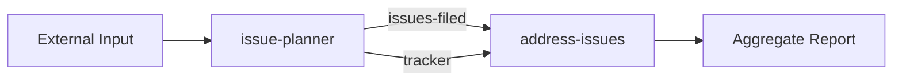

# Contract Manifest Skill

Generate a manifest showing how a chain of AIWG skills connects — mapping each skill's `ensures:` outputs to the next skill's `requires:` inputs.

## Triggers

- "show the contract manifest for [skill1] → [skill2] → [skill3]"
- "how does [workflow] wire together?"
- "generate manifest for this skill chain"
- "show data flow for [issue-planner] → [address-issues]"
- "what does [skill] produce and what does [skill] need?"

## Parameters

### Skills list (positional)

Ordered list of skill names or paths:

```bash
/contract-manifest issue-planner address-issues
/contract-manifest prose-detect prose-run forme-manifest
```

### `--workflow <file>` (optional)

Path to a YAML workflow definition:

```yaml
# workflow.yaml
name: Issue Planning Pipeline
steps:
  - skill: issue-planner
  - skill: address-issues
  - skill: issue-sync
```

### `--mermaid` (optional)

Include a Mermaid LR diagram of the skill chain.

### `--json` (optional)

Output the manifest as machine-readable JSON instead of Markdown.

## Behavior

### Step 1: Resolve Skills

For each skill name, find the canonical `SKILL.md`:
1. Check `agentic/code/frameworks/sdlc-complete/skills/{name}/SKILL.md`
2. Check `agentic/code/addons/*/skills/{name}/SKILL.md`
3. Check `.claude/skills/{name}/SKILL.md`
4. If path given directly: read that file

### Step 2: Extract Contracts

From each skill's YAML frontmatter, extract:
- `requires:` — inputs the skill needs
- `ensures:` — outputs the skill commits to deliver
- `errors:` — failure conditions
- `invariants:` — always-true properties

If a skill has no contract fields, note it as "contract not yet defined."

### Step 3: Build Wiring Table

For each skill's `requires:` entry, find the upstream source:

1. **Exact match**: Another skill's `ensures:` entry with the same name → **direct wire** ✓
2. **Semantic match**: Another skill's `ensures:` entry that means the same thing (e.g., `issues-filed` ↔ `issues`) → **semantic wire** ⚠️ (flag as warning)
3. **External input**: The workflow's own `requires:` (user provides it) → **external** →
4. **No match**: Nothing upstream provides it → **unresolved** ❌

### Step 4: Determine Execution Order

- Skills with only external inputs can execute first
- Skills depending on upstream `ensures:` must wait for that skill
- Skills with no dependencies between them can execute in parallel

### Step 5: Output Manifest

```markdown
## Contract Manifest: {workflow name or skill list}

### Skills

| Skill | Requires | Ensures | Errors |
|-------|----------|---------|--------|
| issue-planner | objective, tracker | issues-filed, research-brief | no-tracker-access, research-failed |
| address-issues | issues, tracker | cycle-comments, aggregate-report | tracker-unavailable |

### Data Flow

| Source Skill | Output | → | Target Skill | Input | Match |
|-------------|--------|---|-------------|-------|-------|
| (external) | objective | → | issue-planner | objective | ✓ exact |
| issue-planner | issues-filed | → | address-issues | issues | ⚠️ semantic |
| issue-planner | tracker | → | address-issues | tracker | ✓ exact |

### Execution Order

1. issue-planner (requires: external inputs only)
2. address-issues (requires: issue-planner.issues-filed, issue-planner.tracker)

**Parallel groups**: [issue-planner] → [address-issues]

### Warnings

- `issue-planner.issues-filed` → `address-issues.issues`: semantic match only (names differ; verify intent)

### Issues

- None
```

### Optional: Mermaid Diagram (`--mermaid`)



## Output Formats

| Flag | Format | Use Case |
|------|--------|----------|
| (default) | Markdown | Human review |
| `--json` | JSON | Tooling, CI integration |
| `--mermaid` | Markdown + embedded Mermaid | Documentation |

## Model

Runs on **Sonnet** — contract extraction and matching is structural analysis.

## References

- @$AIWG_ROOT/agentic/code/frameworks/sdlc-complete/README.md — SDLC framework context and skill catalog
- @$AIWG_ROOT/agentic/code/addons/aiwg-utils/rules/research-before-decision.md — Research-first approach for contract resolution
- @$AIWG_ROOT/agentic/code/addons/aiwg-utils/rules/diagram-generation.md — Mermaid diagram generation standards
- @$AIWG_ROOT/docs/extensions/overview.md — Extension system and skill architecture
- @$AIWG_ROOT/docs/cli-reference.md — CLI reference
