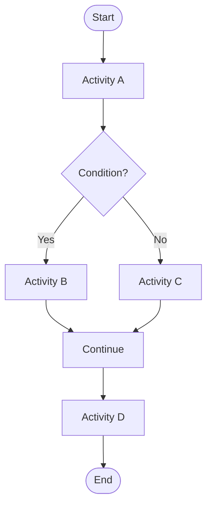
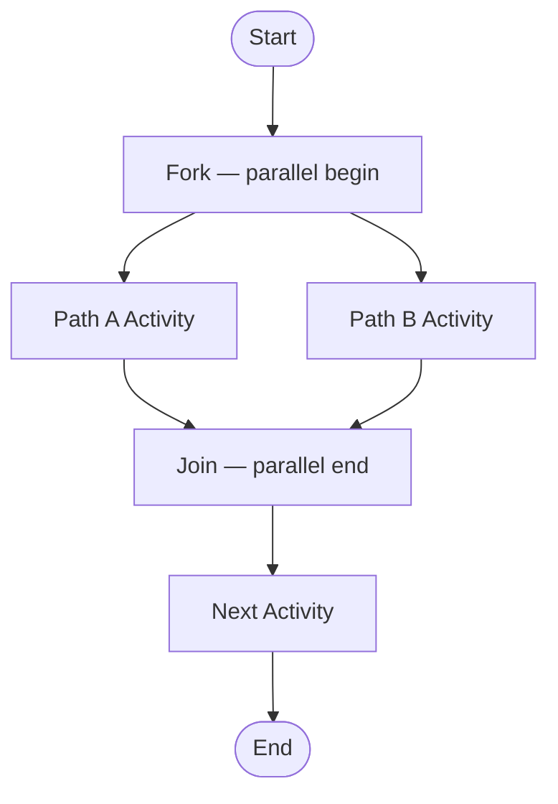
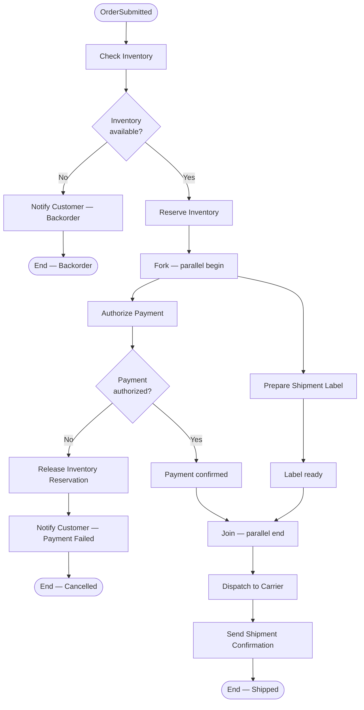

# Activity Diagram Spec

## Metadata

- ID: DES-ACT-`id`
- Owner: `name/role/team`
- Contributors: `list`
- Reviewers: `list`
- Team: `team`
- Stakeholders: `list`
- Status: `draft/in-progress/blocked/approved/done`
- Dates: created `YYYY-MM-DD` / updated `YYYY-MM-DD` / due `YYYY-MM-DD`
- Related: UC-`id`, REQ-`id`, DES-`id`, BS-`id`, CODE-`module`, TEST-`id`

## Related Templates

- agentic/code/frameworks/sdlc-complete/templates/analysis-design/use-case-realization-template.md
- agentic/code/frameworks/sdlc-complete/templates/analysis-design/sequence-diagram-template.md
- agentic/code/frameworks/sdlc-complete/templates/analysis-design/state-machine-spec-template.md
- agentic/code/frameworks/sdlc-complete/templates/analysis-design/decision-table-template.md

## Traceability

- Parent Use Case: UC-`id` — `title`
- Behavioral Spec: BS-`id`
- Interface Contracts: IC-`id`, IC-`id`

## Process Context

- Process Name: `human-readable name for this activity flow`
- Trigger: `what event or call initiates this process`
- Scope: `which component/service/bounded context owns this flow`
- Termination: `conditions under which the process ends normally`

## Activity Diagram

Use `flowchart TD` for top-down flow. Use decision diamonds for branching. Use `par` / `and` notation in comments to mark parallel paths (MermaidJS `flowchart` does not have native fork/join syntax; annotate parallel sections explicitly).

For concurrent paths, annotate with comments:

## Activity Catalog

Every node in the diagram must have a corresponding row here.

| ID | Activity | Swim Lane | Description | Input | Output | Duration Hint |
| -- | -------- | --------- | ----------- | ----- | ------ | ------------- |
| ACT-01 | `activity name` | `actor/system/service` | `what work is done` | `data consumed` | `data produced` | `sync/async/batch` |

## Decision Node Catalog

Every diamond in the diagram must have a corresponding row here.

| ID | Decision | Swim Lane | Condition | True Path | False Path | Data Required |
| -- | -------- | --------- | --------- | --------- | ---------- | ------------- |
| DEC-01 | `decision name` | `actor/system/service` | `boolean expression` | `activity/end` | `activity/end` | `fields needed to evaluate` |

## Swim Lane Assignments

| Swim Lane | Actor / System | Responsibilities in This Flow |
| --------- | -------------- | ----------------------------- |
| `lane name` | `role or component` | `what this participant does in this process` |

## Parallel Paths

Document all fork/join pairs. If no parallelism exists, write `none`.

| Fork After | Parallel Activities | Join Before | Synchronization Rule |
| ---------- | ------------------- | ----------- | -------------------- |
| `activity name` | `activity A, activity B` | `activity name` | `all must complete / first wins / any one completes` |

## Exception Flows

Document all error and exception paths. Every decision node with a failure branch must appear here.

| Trigger | Exception | Handling Activity | Recovery Path | Owner |
| ------- | --------- | ----------------- | ------------- | ----- |
| `what goes wrong` | `exception type or error name` | `compensating activity` | `retry / abort / escalate` | `swim lane responsible` |

## Completeness Checklist

- [ ] Every diagram node appears in the Activity Catalog or Decision Node Catalog
- [ ] Every swim lane in the diagram is listed in the Swim Lane Assignments table
- [ ] Every fork has a corresponding join
- [ ] Every decision node has both a true path and a false path
- [ ] Every exception path leads to a defined recovery or terminal state
- [ ] The process has exactly one start node (`[*]` or `Start`) and at least one end node
- [ ] No orphaned nodes exist (every node is reachable from Start)
- [ ] All parallel activities in the same fork are independent (no shared mutable state)
- [ ] Diagram syntax is valid MermaidJS `flowchart TD`

## How to Fill This Template

1. **Identify the Process**: Name the business process or technical flow being modeled. Link it to the parent use case (UC-`id`).
2. **Define Trigger and Termination**: What event starts this process? What conditions end it normally?
3. **Draw the Diagram First**: Sketch the flow using MermaidJS `flowchart TD`. Start with the happy path, then add decision branches and parallel paths.
4. **Fill the Activity Catalog**: One row per diagram node. Every activity must have a swim lane, input, and output — this is the authoritative spec the diagram visualizes.
5. **Fill the Decision Node Catalog**: One row per diamond. Every decision must have a boolean condition and explicit true/false paths.
6. **Assign Swim Lanes**: Map each activity to the actor or component responsible. If multiple components collaborate, split into separate activities.
7. **Document Parallel Paths**: For every fork, specify the synchronization rule (all must complete, first wins, etc.). Verify parallel activities share no mutable state.
8. **Document Exception Flows**: Every decision node with a failure branch needs an entry. Specify the compensation or recovery activity.
9. **Validate**: Walk the completeness checklist. Every diagram node must appear in a catalog table; every fork must have a join.

## Example

### Process: Order Fulfillment

**Trigger**: `OrderSubmitted` event received by Fulfillment Service.
**Scope**: Fulfillment Service, Inventory Service, Payment Service, Shipping Service.
**Termination**: Order reaches `Shipped` state or is cancelled with refund issued.

**Activity Catalog (excerpt)**:

| ID | Activity | Swim Lane | Description | Input | Output | Duration Hint |
| -- | -------- | --------- | ----------- | ----- | ------ | ------------- |
| ACT-01 | Check Inventory | Inventory Service | Query available stock for all line items | `order.lineItems` | `availabilityMap` | sync |
| ACT-02 | Reserve Inventory | Inventory Service | Place hold on stock to prevent oversell | `order.id, lineItems` | `reservationId` | sync |
| ACT-03 | Authorize Payment | Payment Service | Charge or pre-auth customer payment method | `order.id, amount, paymentMethod` | `authorizationId` | async |
| ACT-04 | Prepare Shipment Label | Shipping Service | Generate carrier label and tracking number | `order.id, address` | `trackingNumber, labelUrl` | async |
| ACT-05 | Dispatch to Carrier | Shipping Service | Hand package to carrier and emit ShipmentEvent | `trackingNumber` | `dispatchConfirmation` | sync |
| ACT-06 | Release Inventory Reservation | Inventory Service | Release hold on reserved stock | `reservationId` | none | sync |
| ACT-07 | Send Shipment Confirmation | Notification Service | Email customer with tracking link | `order.id, trackingNumber` | none | async |

**Decision Node Catalog (excerpt)**:

| ID | Decision | Swim Lane | Condition | True Path | False Path | Data Required |
| -- | -------- | --------- | --------- | --------- | ---------- | ------------- |
| DEC-01 | Inventory available? | Inventory Service | `availabilityMap.allAvailable == true` | Reserve Inventory | Notify Customer — Backorder | `availabilityMap` |
| DEC-02 | Payment authorized? | Payment Service | `authorizationId != null && !authorizationId.expired` | Payment confirmed | Release Inventory Reservation | `authorizationId` |

**Parallel Paths**:

| Fork After | Parallel Activities | Join Before | Synchronization Rule |
| ---------- | ------------------- | ----------- | -------------------- |
| Reserve Inventory | Authorize Payment, Prepare Shipment Label | Join — parallel end | all must complete |

**Exception Flows**:

| Trigger | Exception | Handling Activity | Recovery Path | Owner |
| ------- | --------- | ----------------- | ------------- | ----- |
| Payment authorization fails | `PaymentAuthorizationException` | Release Inventory Reservation | abort; notify customer | Payment Service |
| Carrier API timeout | `ShippingProviderTimeoutException` | Retry up to 3 times, then escalate | retry with backoff; escalate to ops if exhausted | Shipping Service |
| Inventory reservation conflict | `InventoryConflictException` | Release and re-check | re-evaluate availability | Inventory Service |

## Agent Notes

- Keep diagrams to 15 nodes or fewer; split larger processes into sub-flows with a reference node (`[See DES-ACT-{id}]`).
- Every fork must have an explicit join; dangling parallel paths indicate incomplete design.
- Use swim lanes in comments or diagram titles when MermaidJS `flowchart` cannot express them natively.
- Derive integration test scenarios from exception flows — each exception path is a required negative test.
- Confirm all parallel activities are free of shared mutable state before marking parallelism as valid.
- Save finalized spec to `.aiwg/architecture/activity-diagrams/DES-ACT-{id}.md`.
