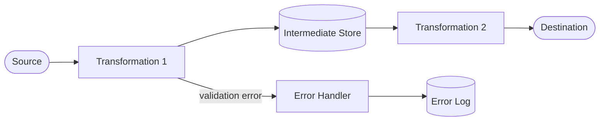
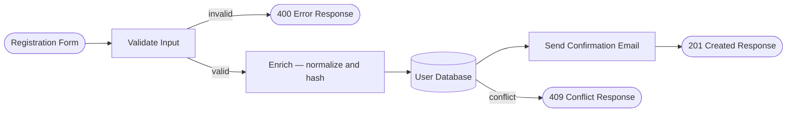

# Data Flow Spec

## Metadata

- ID: DES-DFS-`id`
- Owner: `name/role/team`
- Contributors: `list`
- Reviewers: `list`
- Team: `team`
- Stakeholders: `list`
- Status: `draft/in-progress/blocked/approved/done`
- Dates: created `YYYY-MM-DD` / updated `YYYY-MM-DD` / due `YYYY-MM-DD`
- Related: UC-`id`, REQ-`id`, DES-`id`, BS-`id`, CODE-`module`, TEST-`id`

## Related Templates

- agentic/code/frameworks/sdlc-complete/templates/analysis-design/use-case-realization-template.md
- agentic/code/frameworks/sdlc-complete/templates/analysis-design/interface-contract-card.md
- agentic/code/frameworks/sdlc-complete/templates/analysis-design/method-interface-contract-template.md
- agentic/code/frameworks/sdlc-complete/templates/analysis-design/activity-diagram-spec-template.md

## Traceability

- Parent Use Case: UC-`id` — `title`
- Behavioral Spec: BS-`id`
- Interface Contracts: IC-`id`, IC-`id`

## Flow Context

- Flow Name: `human-readable name for this data flow`
- Trigger: `what event or request initiates the flow`
- Scope: `which components participate in transforming this data`
- Data Classification: `public/internal/confidential/restricted`
- PII Involved: `yes/no — list fields if yes`

## Data Flow Diagram

## Flow Steps

Trace each input field from source through all transformations to its final destination. Every step must identify the actor or system performing the transformation.

| Step | Actor / System | Input | Transformation | Output | Validation Applied |
| ---- | -------------- | ----- | -------------- | ------ | ------------------ |
| 1 | `actor or system` | `field(s) or structure` | `what happens to the data` | `field(s) or structure` | `constraints checked` |

## Source Specification

| Field | Type | Format | Constraints | Notes |
| ----- | ---- | ------ | ----------- | ----- |
| `fieldName` | `type` | `format` | `not-null, range, pattern` | `semantics` |

## Transformation Catalog

Each named transformation in the diagram must have a row here.

| ID | Transformation Name | Actor / System | Input Schema | Logic | Output Schema | Failure Mode |
| -- | ------------------- | -------------- | ------------ | ----- | ------------- | ------------ |
| T1 | `name` | `component` | `input fields` | `rule in plain language` | `output fields` | `what happens on failure` |

## Intermediate States

Data stores, queues, or in-memory structures where data rests between transformations.

| ID | Store Name | Type | Owner | Schema | Retention | Access Control |
| -- | ---------- | ---- | ----- | ------ | --------- | -------------- |
| IS1 | `name` | `database/queue/cache/in-memory` | `team/component` | `key fields` | `TTL or policy` | `read/write roles` |

## Destination Specification

| Field | Type | Mapped From | Transformation Applied | Guaranteed Present |
| ----- | ---- | ----------- | ---------------------- | ------------------ |
| `fieldName` | `type` | `source field` | `derivation rule or none` | yes/no |

## Validation Constraints

Constraints enforced at each stage. A constraint that fails must produce a specific error; silent data loss is not acceptable.

| Stage | Field | Constraint | Error on Failure | Severity |
| ----- | ----- | ---------- | ---------------- | -------- |
| `step or transform name` | `field` | `rule` | `error name or code` | `blocking/warning` |

## Data Sensitivity and Handling

| Field | Classification | PII | Masking Rule | Audit Logged | Encryption Required |
| ----- | -------------- | --- | ------------ | ------------ | ------------------- |
| `fieldName` | `public/internal/confidential/restricted` | yes/no | `mask pattern or none` | yes/no | yes/no |

## Completeness Checklist

- [ ] Every source field is traceable to a destination field or documented as intentionally dropped
- [ ] Every transformation in the diagram has a row in the Transformation Catalog
- [ ] Every intermediate store has a row in the Intermediate States table
- [ ] All validation constraints have a defined failure mode (no silent data loss)
- [ ] All PII fields are identified and have masking and audit rules
- [ ] Data classification is specified for the flow and for each sensitive field
- [ ] The diagram matches the Flow Steps table exactly
- [ ] Diagram syntax is valid MermaidJS `flowchart`

## Example

### Flow: User Registration

**Trigger**: User submits registration form via `POST /api/v1/users/register`.
**Scope**: API Gateway, Validation Service, User Service, Email Service, User Database.
**Data Classification**: Confidential (contains PII).
**PII Involved**: yes — `email`, `fullName`, `dateOfBirth`.

**Flow Steps**:

| Step | Actor / System | Input | Transformation | Output | Validation Applied |
| ---- | -------------- | ----- | -------------- | ------ | ------------------ |
| 1 | API Gateway | raw HTTP body | parse JSON, extract fields | `RegistrationRequest` DTO | schema validation, required fields, content-type |
| 2 | Validation Service | `RegistrationRequest` | validate each field against rules | validated DTO or `ValidationError` | email format, password strength, age ≥ 18 |
| 3 | User Service | validated DTO | normalize email (lowercase), hash password (bcrypt, cost=12), generate userId (UUIDv7) | `UserRecord` | uniqueness check on email |
| 4 | User Service | `UserRecord` | insert into users table | persisted `User` entity | uniqueness constraint; raise conflict on duplicate |
| 5 | Email Service | `user.email, user.fullName, user.id` | generate confirmation token, render email template | `ConfirmationEmail` task | none |
| 6 | API Gateway | persisted `user.id` | serialize to JSON, omit sensitive fields | `201 Created` response | none |

**Source Specification**:

| Field | Type | Format | Constraints | Notes |
| ----- | ---- | ------ | ----------- | ----- |
| email | string | RFC 5322 | required, max 254 chars | used as login identifier |
| password | string | UTF-8 | required, 12–128 chars, ≥1 uppercase, ≥1 digit, ≥1 symbol | never stored in plaintext |
| fullName | string | UTF-8 | required, 1–100 chars | display only |
| dateOfBirth | string | ISO 8601 date | required | used for age verification |
| marketingOptIn | boolean | — | optional, defaults to false | consent flag |

**Transformation Catalog**:

| ID | Transformation Name | Actor / System | Input Schema | Logic | Output Schema | Failure Mode |
| -- | ------------------- | -------------- | ------------ | ----- | ------------- | ------------ |
| T1 | Validate Input | Validation Service | `RegistrationRequest` | Check all constraints per Source Specification | validated DTO | return `400 ValidationError` with field-level detail |
| T2 | Normalize Email | User Service | `email: string` | `email.trim().toLowerCase()` | `normalizedEmail: string` | none (pure) |
| T3 | Hash Password | User Service | `password: string` | bcrypt with cost factor 12 | `passwordHash: string` | raise `HashingException`; abort registration |
| T4 | Generate UserId | User Service | none | UUIDv7 (time-ordered) | `userId: string` | none (pure) |
| T5 | Persist User | User Service | `UserRecord` | INSERT into `users` table | `User` entity | raise `DuplicateEmailException` on conflict → `409` |
| T6 | Send Confirmation | Email Service | `userId, email, fullName` | generate token (HMAC-SHA256), queue email | `ConfirmationTask` enqueued | log failure, do not block registration response |

**Intermediate States**:

| ID | Store Name | Type | Owner | Schema | Retention | Access Control |
| -- | ---------- | ---- | ----- | ------ | --------- | -------------- |
| IS1 | users table | database (PostgreSQL) | User Service | `userId, normalizedEmail, passwordHash, fullName, dateOfBirth, marketingOptIn, createdAt` | indefinite | User Service write; Auth Service read |
| IS2 | email-tasks queue | message queue (RabbitMQ) | Email Service | `taskId, userId, email, fullName, confirmationToken, enqueuedAt` | until consumed or TTL 24h | Email Service consume; User Service publish |

**Destination Specification**:

| Field | Type | Mapped From | Transformation Applied | Guaranteed Present |
| ----- | ---- | ----------- | ---------------------- | ------------------ |
| id | string (UUID) | generated (T4) | none | yes |
| email | string | source `email` | normalized (T2) | yes |
| createdAt | datetime | system clock | ISO 8601 UTC format | yes |

**Data Sensitivity and Handling**:

| Field | Classification | PII | Masking Rule | Audit Logged | Encryption Required |
| ----- | -------------- | --- | ------------ | ------------ | ------------------- |
| email | confidential | yes | mask as `u***@domain` in logs | yes (write) | yes (at rest) |
| password | restricted | yes | never log; hash before store | yes (write attempt) | N/A — never stored |
| passwordHash | restricted | yes | never expose in API response | no | yes (at rest) |
| fullName | confidential | yes | none in internal logs | no | yes (at rest) |
| dateOfBirth | confidential | yes | none in internal logs | no | yes (at rest) |
| marketingOptIn | internal | no | none | yes (write) | no |

## How to Fill This Template

1. **Identify Source and Destination**: What data enters the flow and where does it end up? Document every source field with its type, format, and constraints.
2. **Draw the Diagram First**: Sketch the data flow using MermaidJS `flowchart LR`. Show sources, transformations, intermediate stores, destinations, and error paths.
3. **Fill the Flow Steps Table**: One row per processing step. Every step must name the actor/system performing the transformation.
4. **Fill the Transformation Catalog**: One row per named transformation in the diagram. Include input schema, logic, output schema, and failure mode.
5. **Document Intermediate States**: Every place where data rests between transformations (database, queue, cache) gets a row with schema, retention, and access control.
6. **Fill the Destination Specification**: Map each output field back to its source. Verify every source field is traceable to a destination or documented as intentionally dropped.
7. **Document Validation Constraints**: At each stage, what can go wrong? Every constraint must produce a specific error — no silent data loss.
8. **Classify Data Sensitivity**: Identify PII fields, masking rules, audit logging requirements, and encryption needs. This is a compliance checkpoint.
9. **Validate**: Walk the completeness checklist. Every diagram element must appear in a table; every source field must reach a destination or be explicitly dropped.

## Agent Notes

- Trace every source field to its destination; any field that is intentionally discarded must be documented with a justification.
- Silent data loss (a field that disappears between steps without documentation) is a compliance risk — flag it during review.
- Every transformation that handles PII must be verified against the Data Sensitivity table before implementation.
- Generate data-flow-based test cases: one per transformation (happy path), one per validation constraint failure, one per conflict / error path.
- If a transformation involves branching logic with 3 or more conditions, extract it to a DES-DT and reference it.
- Confirm the MermaidJS diagram is syntactically valid before committing.
- Save finalized spec to `.aiwg/architecture/data-flows/DES-DFS-{id}.md`.
