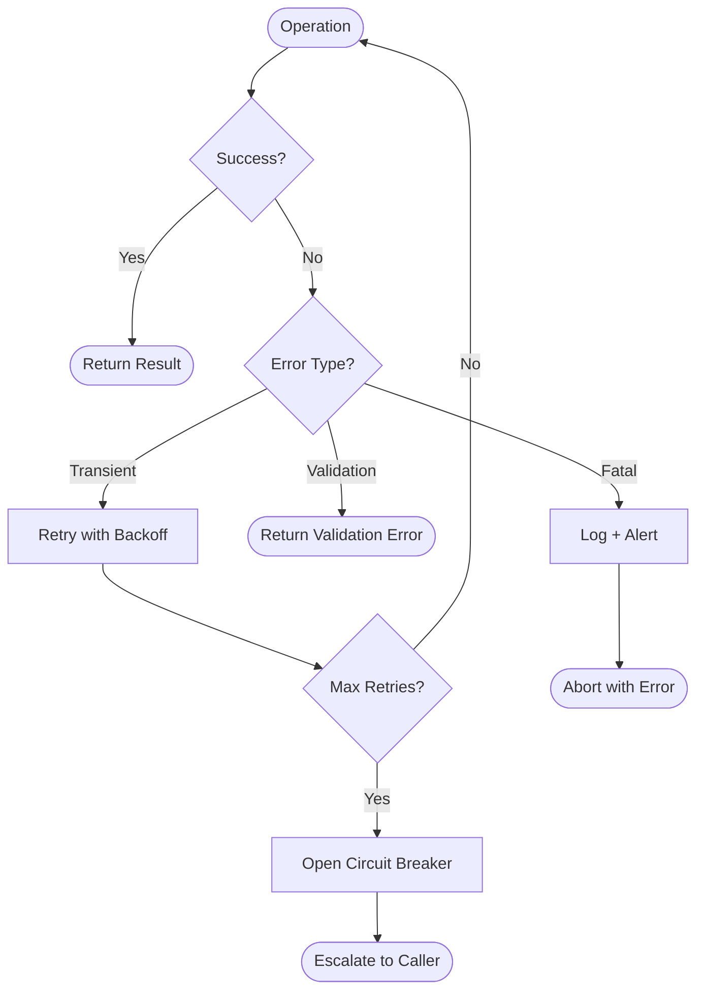
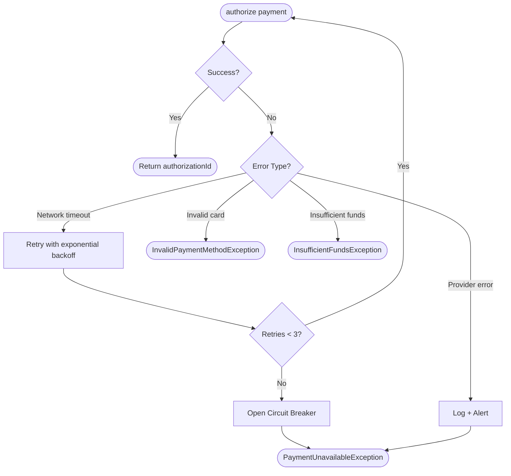

# Error Handling Tree

## Metadata

- ID: DES-EHT-`id`
- Owner: `name/role/team`
- Contributors: `list`
- Reviewers: `list`
- Team: `team`
- Stakeholders: `list`
- Status: `draft/in-progress/blocked/approved/done`
- Dates: created `YYYY-MM-DD` / updated `YYYY-MM-DD` / due `YYYY-MM-DD`
- Related: UC-`id`, REQ-`id`, DES-`id`, BS-`id`, IC-`id`, PSC-`id`, CODE-`module`, TEST-`id`

## Related Templates

- agentic/code/frameworks/sdlc-complete/templates/analysis-design/pseudocode-spec-template.md
- agentic/code/frameworks/sdlc-complete/templates/analysis-design/method-interface-contract-template.md
- agentic/code/frameworks/sdlc-complete/templates/analysis-design/activity-diagram-spec-template.md
- agentic/code/frameworks/sdlc-complete/templates/analysis-design/state-machine-spec-template.md

## Traceability

- Parent Use Case: UC-`id` — `title`
- Behavioral Spec: BS-`id`
- Interface Contracts: DES-MIC-`id`, DES-MIC-`id`
- Pseudo-Code Specs: DES-PSC-`id`, DES-PSC-`id`

## Error Context

- Component / Service: `fully qualified name of the component this tree covers`
- Scope: `single method / module / service boundary / cross-service flow`
- Error Philosophy: `fail-fast / fail-safe / retry-first / circuit-breaker`
- Caller Expectations: `caller receives typed error / HTTP status / event / nothing (fire-and-forget)`

## Error Propagation Diagram

## Exception Catalog

Every exception this component can raise or receive. Each row must trace to an interface contract exception specification (DES-MIC).

| ID | Exception | Type | Source | Severity | Transient | Notes |
| -- | --------- | ---- | ------ | -------- | --------- | ----- |
| E01 | `ExceptionName` | checked/unchecked | `originating component or operation` | `fatal/degraded/warning` | yes/no | `additional context` |

## Error Handling Matrix

Map each exception to its handler and recovery strategy.

| Exception (ID) | Detection Point | Handler Action | Recovery Strategy | Fallback | Caller Notification |
| --------------- | --------------- | -------------- | ----------------- | -------- | ------------------- |
| E01 | `where in the flow this is caught` | `what the handler does` | `retry / compensate / abort / degrade` | `fallback behavior or none` | `error code / HTTP status / event` |

## Retry Specifications

For each transient exception that is retried, document the retry policy.

| Exception (ID) | Max Retries | Backoff Strategy | Initial Delay | Max Delay | Jitter | Circuit Breaker Threshold |
| --------------- | ----------- | ---------------- | ------------- | --------- | ------ | ------------------------- |
| E01 | `count` | `constant/linear/exponential` | `ms` | `ms` | `yes/no` | `N failures in M seconds` |

## Compensation Actions

For operations that must be undone on failure (saga pattern), document the compensation chain.

| Failed Operation | Compensation Action | Idempotent | Timeout | Owner |
| ---------------- | ------------------- | ---------- | ------- | ----- |
| `what succeeded before the failure` | `what must be undone` | yes/no | `ms` | `component responsible` |

## Error Propagation Rules

Define how errors flow between layers. Every boundary crossing must have an explicit mapping.

| Source Layer | Source Error | Target Layer | Target Error | Transformation | Information Lost |
| ------------ | ----------- | ------------ | ------------ | -------------- | ---------------- |
| `service / module` | `internal error` | `API / caller` | `external error` | `mapping rule` | `what details are stripped (security)` |

## Logging and Observability

| Exception (ID) | Log Level | Log Fields | Alert Rule | Dashboard |
| --------------- | --------- | ---------- | ---------- | --------- |
| E01 | `error/warn/info` | `fields to capture (no PII in plaintext)` | `threshold for paging` | `link to dashboard or panel` |

## Completeness Checklist

- [ ] Every exception in the Exception Catalog has a row in the Error Handling Matrix
- [ ] Every transient exception has a Retry Specification
- [ ] Every multi-step operation with side effects has a Compensation Action chain
- [ ] Error Propagation Rules cover every layer boundary (service → API, module → module)
- [ ] No exception is silently swallowed — every handler has an explicit recovery or escalation
- [ ] Logging captures enough context to diagnose without exposing PII
- [ ] Retry policies have both max-retries and circuit-breaker thresholds
- [ ] The Error Propagation Diagram matches the Exception Catalog
- [ ] Fatal errors have alerting rules defined

## How to Fill This Template

1. **Inventory Exceptions**: Start from the interface contracts (DES-MIC) for all methods in scope. Every exception spec becomes a row in the Exception Catalog.
2. **Classify**: Mark each exception as transient or permanent. Transient errors get retry specs; permanent errors get immediate handling.
3. **Draw the Diagram**: Sketch the error flow using MermaidJS. Show the decision tree: success → return, transient → retry → circuit breaker, validation → reject, fatal → abort.
4. **Fill the Handling Matrix**: For each exception, document where it's detected, what the handler does, and how the system recovers.
5. **Define Retry Policies**: For transient errors, specify backoff strategy, max retries, and circuit breaker thresholds. Avoid unbounded retries.
6. **Define Compensations**: For saga-style flows, document what must be undone when a later step fails. Every compensation must be idempotent.
7. **Map Propagation Rules**: At every layer boundary, document how internal errors are translated to external errors. Strip internal details for security.
8. **Add Observability**: Every exception needs a log level and captured fields. Fatal errors need alerting rules.
9. **Validate**: Walk the completeness checklist. No silent swallowing; no unbounded retries; no unlogged fatals.

## Example

### Component: PaymentService

**Scope**: All operations in `PaymentService` module.
**Error Philosophy**: Retry-first for transient failures; fail-fast for validation; compensate for partial success.

**Exception Catalog**:

| ID | Exception | Type | Source | Severity | Transient | Notes |
| -- | --------- | ---- | ------ | -------- | --------- | ----- |
| E01 | NetworkTimeoutException | unchecked | HTTP client → payment provider | degraded | yes | Provider API latency spike |
| E02 | InvalidPaymentMethodException | checked | Payment provider response | warning | no | Card expired, invalid number, etc. |
| E03 | InsufficientFundsException | checked | Payment provider response | warning | no | Customer has insufficient balance |
| E04 | PaymentProviderException | unchecked | Payment provider 5xx | fatal | yes | Provider-side outage |
| E05 | PaymentUnavailableException | checked | Circuit breaker open | degraded | no | Surfaced to caller after retries exhausted |

**Error Handling Matrix**:

| Exception (ID) | Detection Point | Handler Action | Recovery Strategy | Fallback | Caller Notification |
| --------------- | --------------- | -------------- | ----------------- | -------- | ------------------- |
| E01 | HTTP client timeout | catch, increment retry counter | retry with backoff | open circuit breaker after max retries | PaymentUnavailableException |
| E02 | Provider response code `card_invalid` | map to domain exception | none — immediate rejection | none | InvalidPaymentMethodException (400) |
| E03 | Provider response code `insufficient_funds` | map to domain exception | none — immediate rejection | none | InsufficientFundsException (402) |
| E04 | Provider HTTP 5xx | log error, increment retry counter | retry with backoff | open circuit breaker | PaymentUnavailableException (503) |
| E05 | Circuit breaker state check | skip provider call | none — circuit is open | none | PaymentUnavailableException (503) |

**Retry Specifications**:

| Exception (ID) | Max Retries | Backoff Strategy | Initial Delay | Max Delay | Jitter | Circuit Breaker Threshold |
| --------------- | ----------- | ---------------- | ------------- | --------- | ------ | ------------------------- |
| E01 | 3 | exponential | 200ms | 5000ms | yes (0-100ms) | 5 failures in 60 seconds |
| E04 | 3 | exponential | 500ms | 10000ms | yes (0-200ms) | 3 failures in 30 seconds |

**Error Propagation Rules**:

| Source Layer | Source Error | Target Layer | Target Error | Transformation | Information Lost |
| ------------ | ----------- | ------------ | ------------ | -------------- | ---------------- |
| PaymentService | NetworkTimeoutException | OrderService (caller) | PaymentUnavailableException | wrap with generic message | provider URL, timeout duration |
| PaymentService | PaymentProviderException | OrderService (caller) | PaymentUnavailableException | wrap with generic message | provider error body, trace ID (logged internally) |
| OrderService | PaymentUnavailableException | API Gateway | 503 Service Unavailable | map to HTTP status | exception stack trace, internal error ID |

## Agent Notes

- Create one DES-EHT per component or service boundary; do not mix error trees from unrelated components.
- Every exception must trace back to a DES-MIC exception specification — if an exception has no interface contract, it's undocumented behavior.
- Retry policies must always have a ceiling (max retries + circuit breaker). Unbounded retries are a reliability hazard.
- Compensation actions must be idempotent — a compensation that fails and is retried must produce the same result.
- Error propagation rules should strip internal details at every trust boundary to prevent information leakage.
- Generate negative test cases directly: one per exception, one per retry exhaustion, one per circuit breaker trip, one per compensation chain.
- Save finalized spec to `.aiwg/architecture/error-handling/DES-EHT-{id}.md`.
