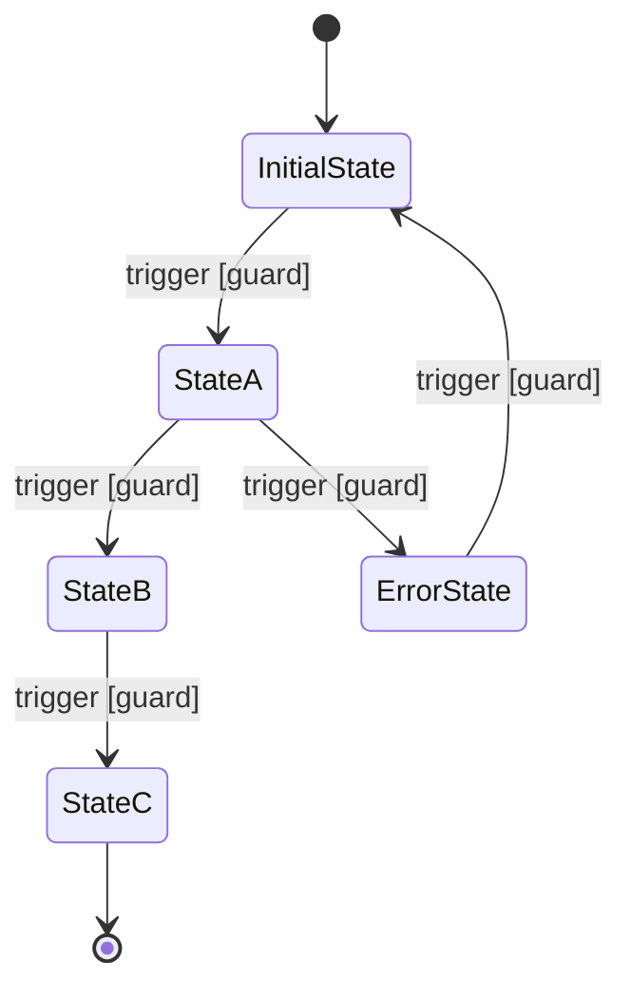
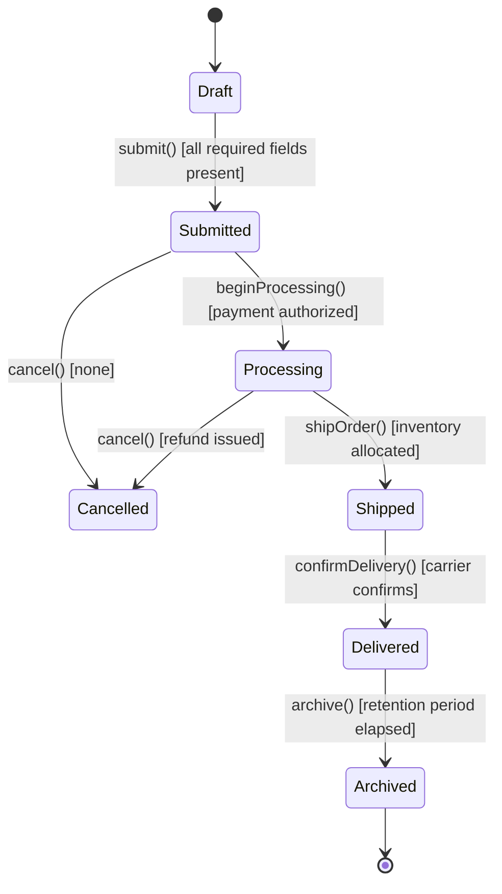

# State Machine Spec

## Metadata

- ID: DES-SM-`id`
- Owner: `name/role/team`
- Contributors: `list`
- Reviewers: `list`
- Team: `team`
- Stakeholders: `list`
- Status: `draft/in-progress/blocked/approved/done`
- Dates: created `YYYY-MM-DD` / updated `YYYY-MM-DD` / due `YYYY-MM-DD`
- Related: UC-`id`, REQ-`id`, DES-`id`, BS-`id`, CODE-`module`, TEST-`id`

## Related Templates

- agentic/code/frameworks/sdlc-complete/templates/analysis-design/use-case-realization-template.md
- agentic/code/frameworks/sdlc-complete/templates/analysis-design/activity-diagram-spec-template.md
- agentic/code/frameworks/sdlc-complete/templates/analysis-design/interface-contract-card.md
- agentic/code/frameworks/sdlc-complete/templates/analysis-design/sequence-diagram-template.md

## Traceability

- Parent Use Case: UC-`id` — `title`
- Behavioral Spec: BS-`id`
- Interface Contracts: IC-`id`, IC-`id`

## Entity Reference

- Entity Name: `name of entity whose lifecycle this state machine governs`
- Entity Type: `domain object/aggregate root/value object/process`
- Persistence: `stored in table/collection/cache — identifier field(s)`
- Concurrency Model: `optimistic locking/pessimistic locking/event-sourced/none`

## State Diagram

## State Catalog

All reachable states for this entity. Every row must be traceable to at least one transition in the Transition Table.

| State | Description | Entry Action | Exit Action | Invariant |
| ----- | ----------- | ------------ | ----------- | --------- |
| `StateName` | `what this state means in business terms` | `action executed on entry` | `action executed on exit` | `condition always true while in this state` |

## Transition Table

Every transition must have a trigger. Guards and actions may be empty but must be explicitly marked `none` to confirm they were considered.

| From State | To State | Trigger | Guard | Action | Error Handling |
| ---------- | -------- | ------- | ----- | ------ | -------------- |
| `State` | `State` | `event name` | `boolean condition or none` | `side effect or none` | `exception / rollback behavior` |

## Nested States

Document composite states with sub-state machines. Omit section if no nesting applies.

| Parent State | Sub-State Machine | Entry Point | Exit Point | Notes |
| ------------ | ----------------- | ----------- | ---------- | ----- |
| `State` | `sub-machine name` | `initial sub-state` | `completion sub-state` | `reason for nesting` |

## Invariants

Conditions that must hold true regardless of state. Violations indicate a data-integrity or concurrency bug.

- `invariant 1: written as a boolean assertion`
- `invariant 2: written as a boolean assertion`

## Completeness Checklist

- [ ] Every state in the State Catalog appears in the Transition Table as a source or destination
- [ ] No dead states exist (every non-terminal state has at least one outbound transition)
- [ ] Initial state is defined and reachable from `[*]`
- [ ] Terminal state(s) are defined and transition to `[*]`
- [ ] Every transition specifies a trigger (event or condition)
- [ ] Every guard is a boolean expression evaluable at runtime
- [ ] Every entry and exit action is a concrete operation (or explicitly `none`)
- [ ] Every invariant is falsifiable and testable
- [ ] Nested state machines are individually complete by this same checklist
- [ ] State diagram matches Transition Table exactly (no discrepancies)

## How to Fill This Template

1. **Identify the Entity**: Name the domain object, aggregate, or process whose lifecycle this state machine governs. Specify persistence and concurrency model.
2. **List All States**: Enumerate every reachable state. Each state should have a clear business meaning, not just a technical label.
3. **Draw the Diagram**: Use MermaidJS `stateDiagram-v2`. Include all transitions with triggers and guards.
4. **Fill the State Catalog**: One row per state. Entry and exit actions must be concrete operations (or explicitly `none`). Every state needs at least one invariant.
5. **Fill the Transition Table**: One row per arrow in the diagram. Every transition needs a trigger; guards and actions can be `none` but must be explicitly stated.
6. **Document Nested States**: If any state contains a sub-state machine, create a separate DES-SM for it and cross-reference.
7. **Define Invariants**: List conditions that hold across all states. These become runtime assertions in the implementation.
8. **Validate**: Walk the completeness checklist. Confirm the diagram and table match exactly — no orphaned states, no missing transitions.

## Example

### Entity: Order

**Scenario**: An order moves from creation through fulfillment to archival, with a cancellation path available before shipping.

**State Catalog (excerpt)**:

| State | Description | Entry Action | Exit Action | Invariant |
| ----- | ----------- | ------------ | ----------- | --------- |
| Draft | Order created but not submitted | none | validate required fields | `order.customerId != null` |
| Submitted | Awaiting payment authorization | send PaymentAuthRequest | none | `order.totalAmount > 0` |
| Processing | Payment confirmed, inventory being reserved | reserve inventory | release reservation lock | `order.paymentId != null` |
| Shipped | Package handed to carrier | send ShipmentNotification | none | `order.trackingNumber != null` |
| Delivered | Carrier confirmed delivery | send DeliveryConfirmation | none | `order.deliveredAt != null` |
| Cancelled | Order voided | issue refund if applicable | none | `order.cancelledAt != null` |
| Archived | Closed for record-keeping | none | none | `order.archivedAt != null` |

**Transition Table (excerpt)**:

| From State | To State | Trigger | Guard | Action | Error Handling |
| ---------- | -------- | ------- | ----- | ------ | -------------- |
| Draft | Submitted | submit() | all required fields present | validate totals, persist | reject with ValidationError |
| Submitted | Processing | beginProcessing() | payment authorized | allocate inventory | revert to Submitted, raise PaymentFailure |
| Processing | Shipped | shipOrder() | inventory allocated | emit ShipmentEvent | revert to Processing, raise FulfillmentError |
| Shipped | Delivered | confirmDelivery() | carrier confirms | update deliveredAt | none |
| Submitted | Cancelled | cancel() | none | void payment auth | none |
| Processing | Cancelled | cancel() | none | issue refund | none |
| Delivered | Archived | archive() | retention period elapsed | compress audit log | none |

**Invariants**:

- `order.customerId != null` (all states)
- `order.createdAt <= order.updatedAt` (all states)
- `order.totalAmount >= 0` (all states)
- `order.cancelledAt != null iff state == Cancelled` (Cancelled only)

## Agent Notes

- Generate one state machine spec per stateful entity; do not merge multiple entities into one document.
- The State Diagram must be syntactically valid MermaidJS `stateDiagram-v2`; validate before committing.
- Every state in the diagram must have a corresponding row in the State Catalog, and vice versa.
- When nesting is needed, create a separate DES-SM-`id` for each sub-state machine and cross-reference.
- Derive test cases directly from this spec: one test per transition, one per guard branch, one per invariant.
- Flag any transition that lacks a guard as a potential uncontrolled side effect requiring product owner sign-off.
- Save finalized spec to `.aiwg/architecture/state-machines/DES-SM-{id}.md`.
