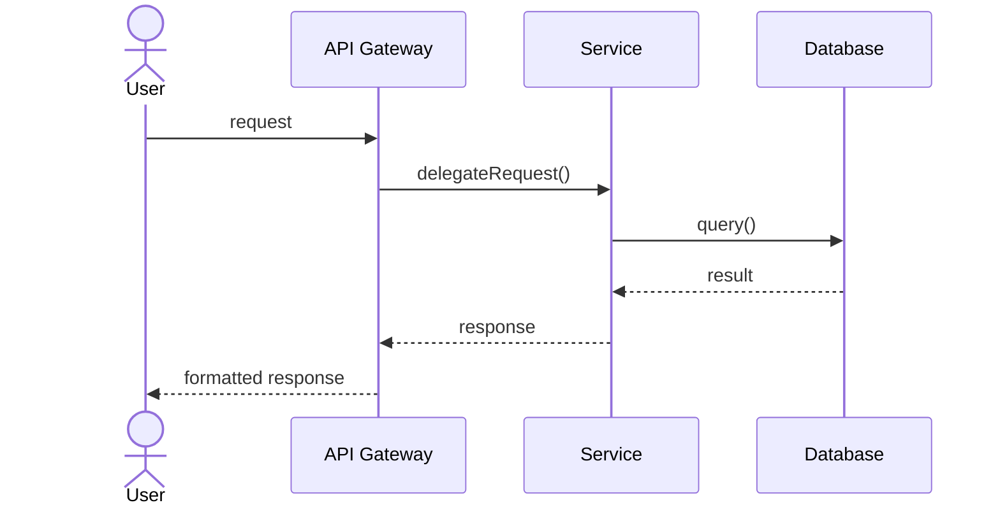
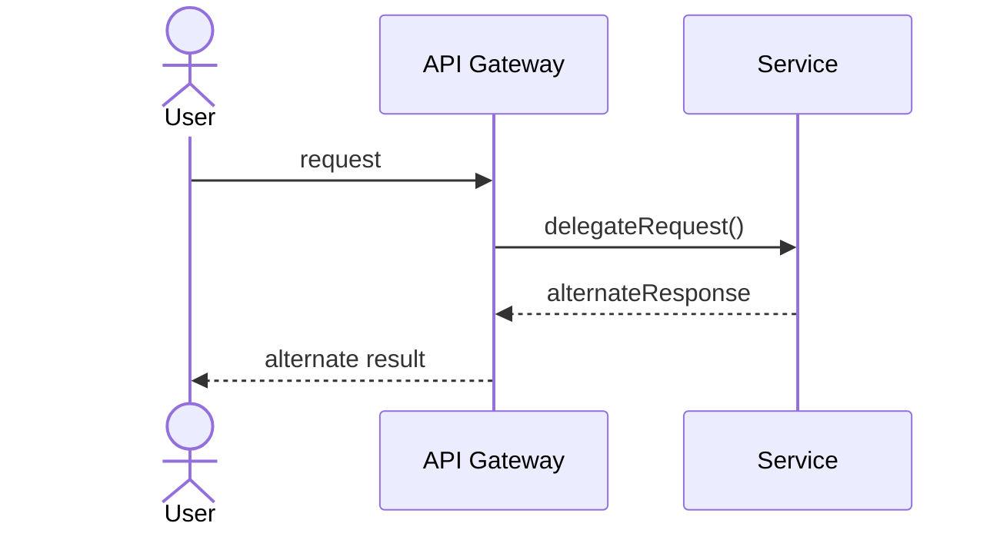
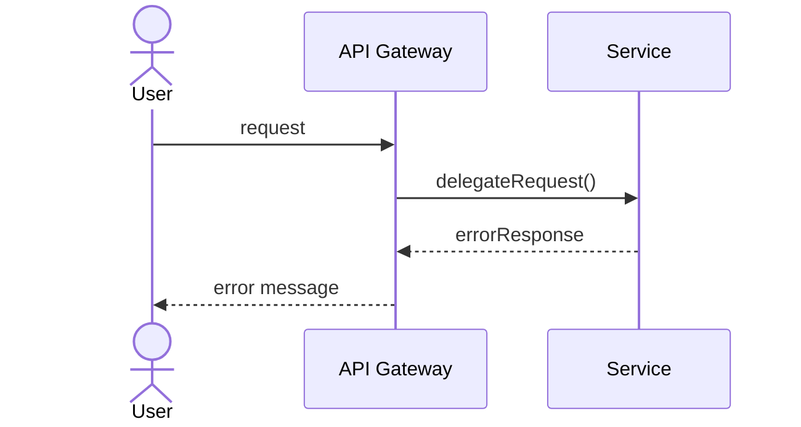
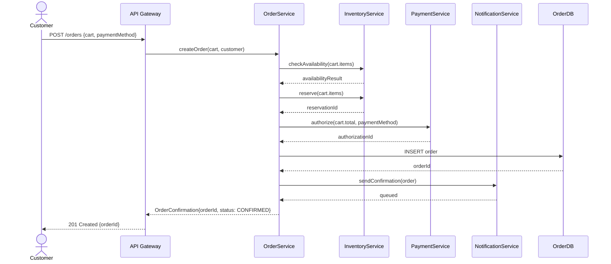
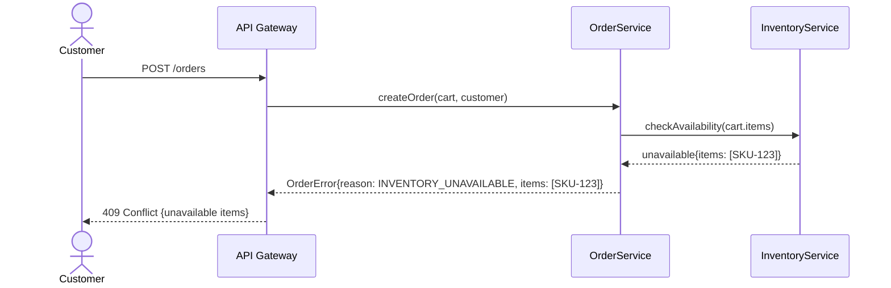
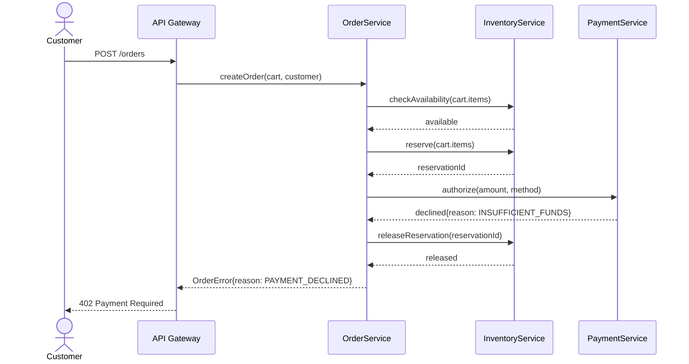

# Use-Case Realization

## Metadata

- ID: DES-UCR-`id`
- Owner: `name/role/team`
- Contributors: `list`
- Reviewers: `list`
- Team: `team`
- Stakeholders: `list`
- Status: `draft/in-progress/blocked/approved/done`
- Dates: created `YYYY-MM-DD` / updated `YYYY-MM-DD` / due `YYYY-MM-DD`
- Related: UC-`id`, REQ-`id`, DES-`id`, BS-`id`, CODE-`module`, TEST-`id`

## Related Templates

- agentic/code/frameworks/sdlc-complete/templates/analysis-design/sequence-diagram-template.md
- agentic/code/frameworks/sdlc-complete/templates/analysis-design/activity-diagram-spec-template.md
- agentic/code/frameworks/sdlc-complete/templates/analysis-design/state-machine-spec-template.md
- agentic/code/frameworks/sdlc-complete/templates/analysis-design/method-interface-contract-template.md
- agentic/code/frameworks/sdlc-complete/templates/analysis-design/interface-contract-card.md

## Traceability

- Parent Use Case: UC-`id` — `title`
- Architecture Document: SAD section `N.N`
- ADRs: ADR-`id`, ADR-`id`
- Interface Contracts: IC-`id`, IC-`id`
- Pseudo-Code Specs: DES-PSC-`id`, DES-PSC-`id`
- Test Cases: TEST-`id`, TEST-`id`

## Use Case Summary

- Use Case ID: UC-`id`
- Title: `use case title`
- Primary Actor: `actor name`
- Scope: `system or subsystem boundary`
- Level: `user goal / subfunction / summary`
- Trigger: `event or action that starts this use case`
- Preconditions: `what must be true before this use case begins`
- Postconditions (success): `what is true when the use case completes successfully`

## Participating Components

Map each actor and component involved in the realization. Every participant must appear in at least one sequence diagram below.

| Participant | Type | Responsibility in This Realization | Interface |
| ----------- | ---- | ---------------------------------- | --------- |
| `Actor Name` | actor | `what the actor does` | `UI / API / CLI` |
| `Component Name` | service/module/class | `what this component does` | `method signatures or API endpoints` |

## Main Success Scenario — Sequence Diagram

The primary flow showing how the use case is realized through component interactions.

### Step-by-Step Realization

Map each use case step to the component interactions that realize it.

| UC Step | Description | From | To | Call / Message | Data | Notes |
| ------- | ----------- | ---- | -- | -------------- | ---- | ----- |
| 1 | `use case step text` | `Actor` | `Component` | `method(params)` | `data exchanged` | `design rationale` |
| 2 | `use case step text` | `Component` | `Component` | `method(params)` | `data exchanged` | `design rationale` |

## Alternate Flows

### Alt Flow `N`: `title`

**Branching Condition**: `at which step and under what condition this alternate flow is triggered`

| UC Step | Description | From | To | Call / Message | Data | Notes |
| ------- | ----------- | ---- | -- | -------------- | ---- | ----- |
| `N.1` | `alternate step text` | `Component` | `Component` | `method(params)` | `data exchanged` | `design rationale` |

## Exception Flows

### Exception `N`: `title`

**Trigger Condition**: `what error or failure triggers this exception flow`
**Originating Step**: `step number in main scenario`

| UC Step | Description | From | To | Call / Message | Recovery | Notes |
| ------- | ----------- | ---- | -- | -------------- | -------- | ----- |
| `E.1` | `exception step text` | `Component` | `Component` | `method(params)` | `retry / abort / compensate` | `error handling rationale` |

## Component Responsibilities

Summarize each component's design obligations within this realization.

| Component | Responsibilities | Design Patterns Applied | State Changes |
| --------- | ---------------- | ----------------------- | ------------- |
| `Component Name` | `what it must do` | `pattern (e.g., Repository, Strategy)` | `entity state transitions triggered` |

## Non-Functional Realization

How NFRs from the use case and supplementary spec are addressed in this design.

| NFR | Requirement | How Addressed | Verification |
| --- | ----------- | ------------- | ------------ |
| Performance | `e.g., < 200ms response` | `caching, indexing, async` | `load test scenario` |
| Security | `e.g., authenticated access` | `JWT validation at gateway` | `penetration test case` |
| Availability | `e.g., 99.9% uptime` | `retry with circuit breaker` | `chaos test` |

## Completeness Checklist

- [ ] Every use case step has a corresponding row in the Step-by-Step Realization table
- [ ] Every component in the Participating Components table appears in at least one sequence diagram
- [ ] Sequence diagrams are valid MermaidJS `sequenceDiagram` syntax
- [ ] Every alternate flow has a branching condition referencing a main scenario step
- [ ] Every exception flow has a trigger condition and recovery path
- [ ] Component responsibilities align with SAD component descriptions
- [ ] State changes reference the governing DES-SM if stateful entities are involved
- [ ] NFR realization covers all NFRs tagged to this use case
- [ ] Traceability IDs link forward to interface contracts and test cases

## How to Fill This Template

1. **Start with the Use Case**: Read the parent use case (UC-`id`) and SAD to understand what is being realized and which components are involved.
2. **List Participants**: Identify every actor, service, module, and external system that participates. Each one becomes a lifeline in the sequence diagram.
3. **Draw the Main Sequence**: Walk through the use case main success scenario step-by-step. For each step, identify which component calls which, what method is invoked, and what data flows.
4. **Fill the Step-by-Step Table**: One row per use case step. The table is the authoritative mapping — the diagram is a visualization of it.
5. **Add Alternate Flows**: For each alternate path in the use case, create a sequence diagram showing where it diverges and how it rejoins or terminates.
6. **Add Exception Flows**: For each failure mode, document the trigger, the error propagation path, and the recovery strategy.
7. **Assign Responsibilities**: Summarize what each component must implement. Reference design patterns and link to DES-SM for state transitions.
8. **Address NFRs**: For each non-functional requirement tagged to this use case, describe how the design meets it.
9. **Validate**: Walk the completeness checklist. Every use case step must have a realization; every diagram participant must be in the components table.

## Example

### Use Case: UC-003 — Place Order

**Summary**: Customer places an order through the storefront. System validates inventory, processes payment, and confirms the order.

**Primary Actor**: Customer
**Scope**: Order Management System
**Trigger**: Customer clicks "Place Order" on the checkout page.

**Participating Components**:

| Participant | Type | Responsibility in This Realization | Interface |
| ----------- | ---- | ---------------------------------- | --------- |
| Customer | actor | Initiates order placement | Web UI |
| API Gateway | service | Authentication, request routing | REST API |
| OrderService | service | Order validation and creation | `createOrder(cart, customer)` |
| InventoryService | service | Stock availability check and reservation | `checkAvailability(items)`, `reserve(items)` |
| PaymentService | service | Payment authorization | `authorize(amount, method)` |
| NotificationService | service | Order confirmation delivery | `sendConfirmation(order)` |
| OrderDB | database | Order persistence | SQL |

**Main Success Scenario**:

**Step-by-Step Realization**:

| UC Step | Description | From | To | Call / Message | Data | Notes |
| ------- | ----------- | ---- | -- | -------------- | ---- | ----- |
| 1 | Customer submits order | Customer | API Gateway | `POST /orders` | cart, paymentMethod | JWT auth validated at gateway |
| 2 | Gateway delegates to order service | API Gateway | OrderService | `createOrder(cart, customer)` | validated request | Synchronous call |
| 3 | Check inventory availability | OrderService | InventoryService | `checkAvailability(items)` | line items | Fails fast if any item unavailable |
| 4 | Reserve inventory | OrderService | InventoryService | `reserve(items)` | line items, orderId | Reservation TTL = 15 min |
| 5 | Authorize payment | OrderService | PaymentService | `authorize(amount, method)` | total, payment method | If fails, release reservation |
| 6 | Persist order | OrderService | OrderDB | `INSERT` | order entity | Status = CONFIRMED |
| 7 | Send confirmation | OrderService | NotificationService | `sendConfirmation(order)` | order details | Async — fire and forget |
| 8 | Return confirmation | OrderService | Customer (via GW) | HTTP 201 | orderId, status | |

**Exception Flow E1: Inventory Unavailable**:

Trigger: `checkAvailability()` returns items with `available = false` at step 3.

**Exception Flow E2: Payment Declined**:

Trigger: `authorize()` returns declined at step 5.

**Component Responsibilities**:

| Component | Responsibilities | Design Patterns Applied | State Changes |
| --------- | ---------------- | ----------------------- | ------------- |
| OrderService | Orchestrate order creation, compensate on failure | Saga (orchestration), Facade | Order: Draft → Confirmed (DES-SM-001) |
| InventoryService | Check and reserve stock atomically | Repository, Optimistic Lock | Inventory: Available → Reserved |
| PaymentService | Authorize payment, support idempotent retries | Gateway, Idempotency Key | Payment: Pending → Authorized |
| NotificationService | Queue and deliver confirmation asynchronously | Observer, Message Queue | — |

**NFR Realization**:

| NFR | Requirement | How Addressed | Verification |
| --- | ----------- | ------------- | ------------ |
| Performance | < 500ms end-to-end | Inventory and payment calls are sequential but each < 200ms SLA; notification is async | Load test: 100 concurrent orders < 500ms p95 |
| Security | Authenticated access only | JWT validation at API Gateway; no PII in logs | Pentest: unauthenticated POST /orders returns 401 |
| Reliability | No orphaned reservations | Saga compensates: payment failure triggers reservation release | Chaos test: kill PaymentService mid-authorize, verify reservation released |

## Agent Notes

- Create one DES-UCR per use case; do not merge multiple use cases into one realization.
- The Step-by-Step Realization table is the source of truth — sequence diagrams visualize it but the table is what gets traced.
- Every component interaction should reference a DES-MIC (method interface contract) for the callee.
- When the main scenario involves state transitions, cross-reference the governing DES-SM and confirm the transition is valid.
- Derive integration test scenarios directly: one per main flow, one per alternate flow, one per exception flow.
- Save finalized realization to `.aiwg/requirements/realizations/DES-UCR-{id}.md`.
