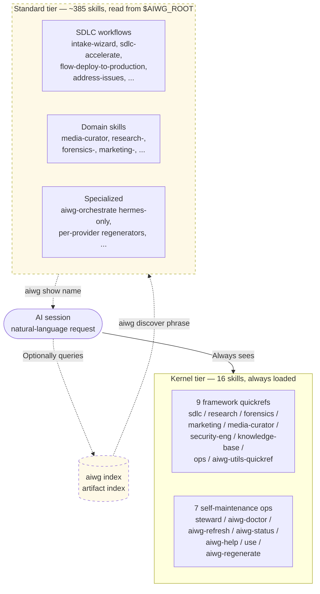
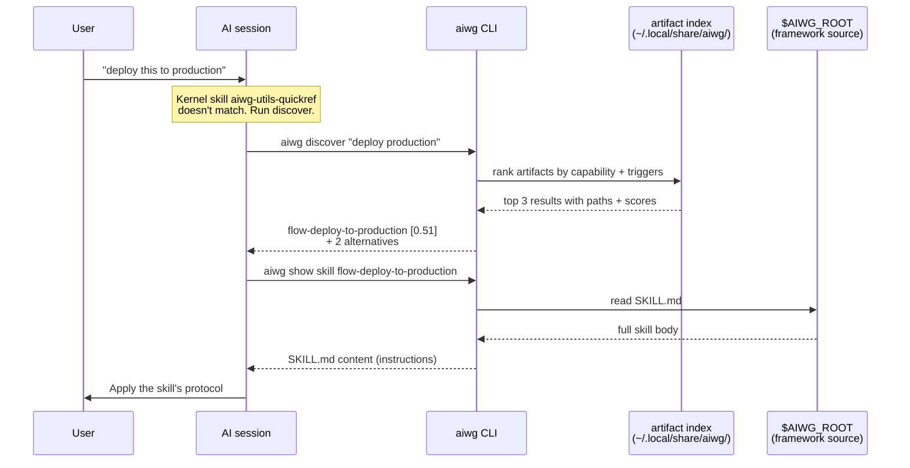
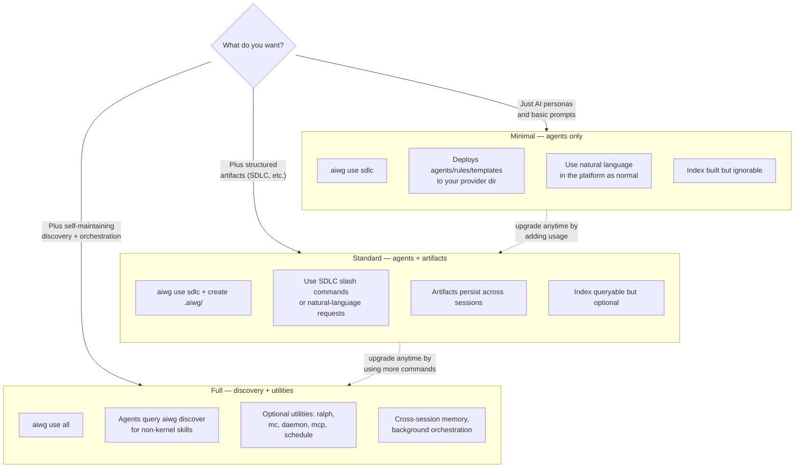
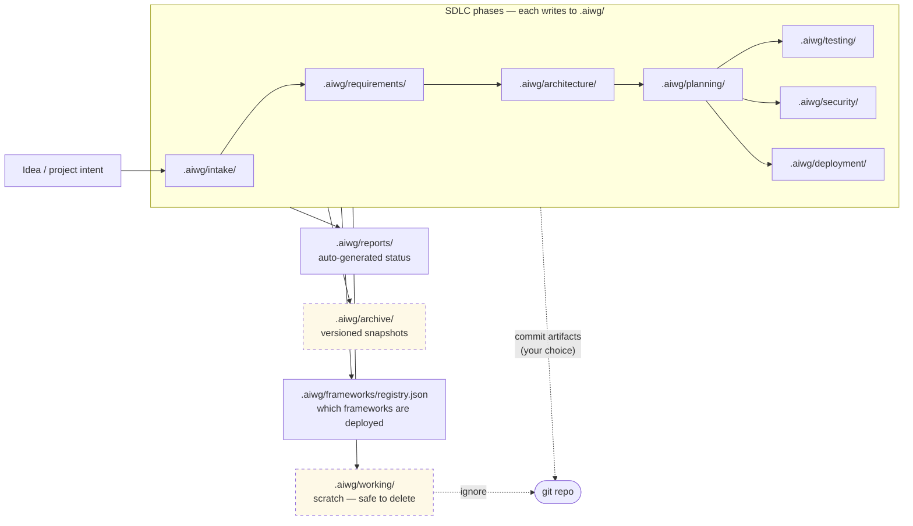
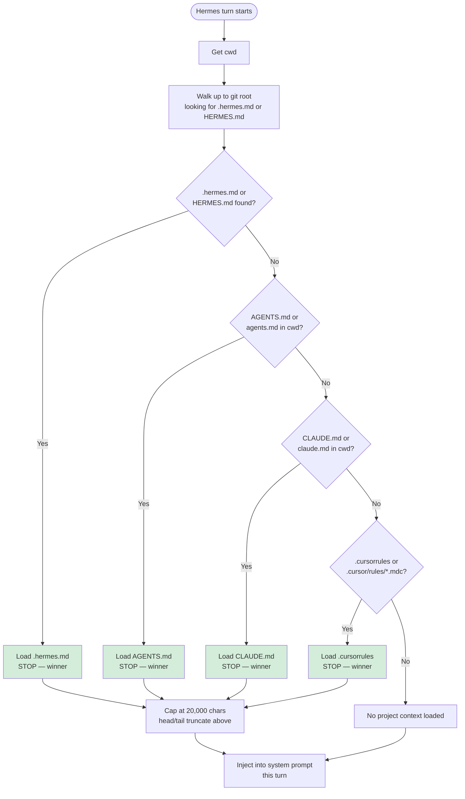
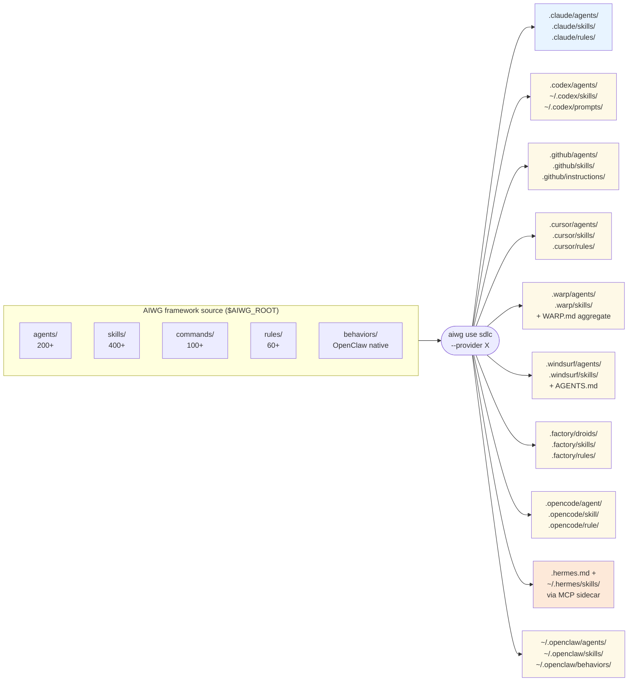
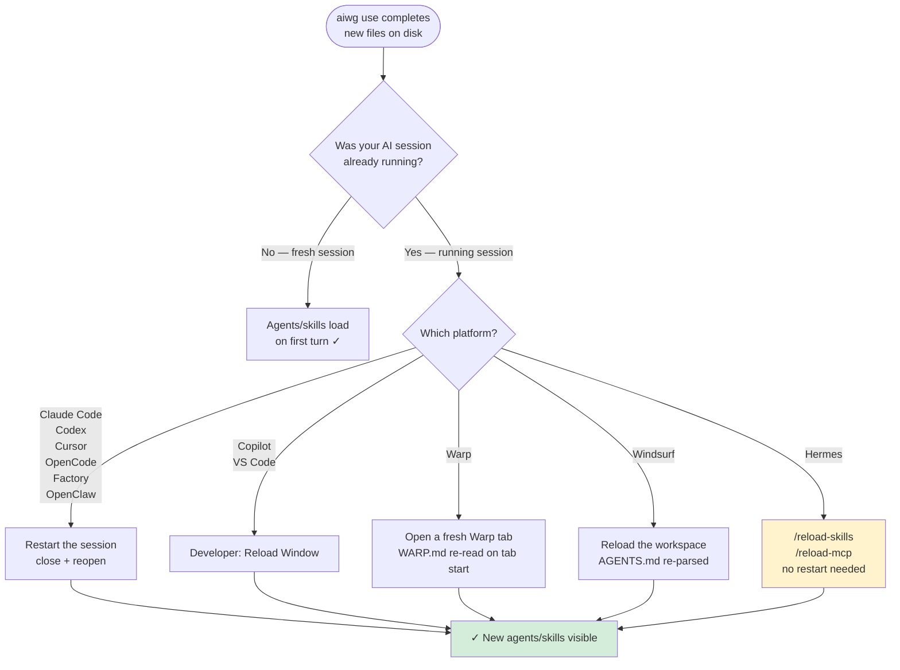

# AIWG Architecture Overview

> **Version**: 2026.5.0+
> **Audience**: Developers, technical leads, CISOs, anyone wanting a visual mental model of AIWG before reading the deeper guides
> **Status**: Mermaid versions inline; polished Gemini-rendered images in `architecture-overview/images/` (placeholders below — see [#1248](https://git.integrolabs.net/roctinam/aiwg/issues/1248) for the prompt set)

This document is the visual entry point for understanding what AIWG is, what it does at deploy time, what it does at runtime, and what's optional. Each section pairs a MermaidJS diagram (renders inline in markdown) with a placeholder for a polished Gemini-generated illustration (drop in `./architecture-overview/images/NN-name.png` and the markdown picks it up).

Deeper guides:

- [`docs/how-it-works.md`](how-it-works.md) — prose walkthrough of the same concepts
- [`docs/discovery-and-kernel-skills.md`](discovery-and-kernel-skills.md) — kernel-vs-standard skill model in depth
- [`docs/integrations/hermes-quickstart.md`](integrations/hermes-quickstart.md) — Hermes-specific integration

---

## 1. AIWG is a deploy-time tool — runtime-invisible

`aiwg use` runs once, copies plain-text files into the directories your AI platform reads, builds an artifact index, and exits. Nothing AIWG produces is a daemon, a service, or a network listener. Once the files land, your platform's native loader handles everything — AIWG can step out of the way.

```mermaid
flowchart LR
  subgraph Source["AIWG framework source"]
    direction TB
    KERN[16 kernel skills<br/>~15-25k tokens]
    STD[~385 standard skills<br/>read from $AIWG_ROOT]
    AGENT[200+ agents]
    RULES[60+ rules]
    TPL[100+ templates]
  end

  CLI([aiwg use sdlc<br/>--provider X]) --> DEPLOY

  subgraph DEPLOY["Deploy step (one-shot)"]
    direction TB
    COPY[Copy kernel skills, agents,<br/>rules to provider-native dirs]
    INDEX[Build artifact index<br/>~/.local/share/aiwg/index/]
    CTX[Emit AIWG.md + AGENTS.md<br/>at project root]
  end

  Source --> CLI
  DEPLOY --> Project

  subgraph Project["Your project (after deploy)"]
    direction TB
    PLAT[.claude/skills/<br/>.codex/agents/<br/>.warp/agents/ ...]
    AIWGMD[AIWG.md / .hermes.md /<br/>WARP.md / AGENTS.md]
    ART[.aiwg/<br/>requirements/<br/>architecture/<br/>...]
  end

  Project --> SESS

  subgraph SESS["AI session (Claude / Codex / Hermes / etc.)"]
    direction TB
    NATIVE[Platform-native loader<br/>reads provider dir]
    DISC([Optional: aiwg discover<br/>+ aiwg show])
  end

  classDef optional stroke-dasharray: 5 5,fill:#fef9e7
  class DISC optional
  class INDEX optional
```

<!-- Polished version: drop ./architecture-overview/images/01-deploy-tool.png to render below -->
<!-- Gemini prompts (v4 illustrated, v3 monospace, v2 editorial): see https://git.integrolabs.net/roctinam/aiwg/issues/1248 -->

---

## 2. The two-tier skill model — kernel vs standard

AIWG ships **400+ skills**. Platform context windows can't fit them all. So AIWG splits them: **16 kernel skills** are always loaded into the platform's flat skill listing; the remaining **~385 standard skills** stay at `$AIWG_ROOT` and reach the agent only when queried via the artifact index.

See [`docs/discovery-and-kernel-skills.md`](discovery-and-kernel-skills.md) for the full kernel inventory, why no-copy is the default for standard skills, and the per-provider deployment paths.

---

## 3. The discover → show flow (the optional layer)

When the kernel skills don't directly answer a user request, the agent reaches into the standard tier via two RPC-style commands: `aiwg discover "<intent>"` ranks all 400+ artifacts by capability, then `aiwg show <type> <name>` fetches the body. This flow is optional — agents can work entirely from the kernel surface for many requests — but when it's needed, the cost is bounded and the answer comes from the indexed ranking, not from a literal-string grep.

The **discover-first protocol** (Rule 1.5 in [`skill-discovery.md`](../agentic/code/addons/aiwg-utils/rules/skill-discovery.md)) makes this the mandatory first move for any query mentioning AIWG, a framework name, or a capability keyword — `Grep`/`Glob`/`Read` against provider artifact directories is forbidden until discover has been consulted in the session. See [issue #1249](https://git.integrolabs.net/roctinam/aiwg/issues/1249) for the rationale.

---

## 4. What's optional — Minimal vs Standard vs Full

Most AIWG users live happily in one of the first two tiers. The Full tier exists; it doesn't punish you for ignoring it.

The upgrade arrows go both ways. Nothing is forced. The opt-in utilities (Ralph for agent loops, Mission Control for background orchestration, Daemon for cross-session persistence, MCP for tool-host integration, Schedule for cron-style automation) only run when you invoke them.

---

## 5. The `.aiwg/` lifecycle

`.aiwg/` is your project's structured workspace — every SDLC phase has a home, the working scratch has a clearly disposable bin, and what you commit to git is your choice. AIWG manages the structure; you choose what's permanent.

`.aiwg/working/` is explicitly ephemeral — safe to delete, typically `.gitignore`'d. Whether to commit the rest of `.aiwg/` is a team decision; many teams commit everything except `working/` and the optional `archive/` directory.

---

## 6. Hermes context-file priority (first-match-wins)

[Hermes Agent](https://github.com/NousResearch/hermes-agent) loads exactly **one** project-context file per turn, by priority. AIWG always emits `.hermes.md` (the priority-1 file), so `AGENTS.md` and `CLAUDE.md` remain valid for Claude Code, Codex, and other providers without interfering with Hermes.

Source: `agent/prompt_builder.py:1410-1436` in the Hermes Agent repo. See [`docs/integrations/hermes-quickstart.md`](integrations/hermes-quickstart.md) for the full integration walkthrough.

---

## 7. Multi-platform deploy — one source, ten targets

AIWG's parity model: write/configure once, deploy to whichever AI platforms your team uses. The source-of-truth tree (`agentic/code/`) translates to ten provider-native target conventions through `aiwg use <framework> --provider <X>`.

Switching platforms doesn't require redoing your team's agent/skill/rule investment — same source, different output convention. Hermes is special-cased because it uses an MCP-sidecar model rather than direct file deployment.

---

## 8. Session reload after `aiwg use`

Every AI platform caches its agent/skill registry at session start. After `aiwg use`, a running session retains its old registry until the right invalidation step runs — and the right step is different per platform. `aiwg use` prints the correct step in its post-deploy "Session reload required" section so operators don't have to guess.

Hermes is the friendliest case — `/reload-skills` and `/reload-mcp` slash commands invalidate without a chat restart. Every other platform requires a session/window/tab reload, which is normal cache-invalidation behavior — not an AIWG-specific friction.

---

## Image generation status

Each diagram above has a polished image placeholder. Generation prompts (three aesthetic options — illustrated computing iconography, illustrated editorial, monospace-terminal) live on [issue #1248](https://git.integrolabs.net/roctinam/aiwg/issues/1248):

- [v4 (illustrated computing iconography — recommended)](https://git.integrolabs.net/roctinam/aiwg/issues/1248#issuecomment-41143)
- [v3 (monospace-terminal — for technical docs preferring that aesthetic)](https://git.integrolabs.net/roctinam/aiwg/issues/1248#issuecomment-41131)
- [v2 (illustrated editorial — for marketing/announcement copy)](https://git.integrolabs.net/roctinam/aiwg/issues/1248#issuecomment-41107)

All three sets share the 1-8 numbering. Generated images drop at `docs/architecture-overview/images/NN-name.png` and the placeholders above pick them up automatically.

---

## Related guides

- [`docs/how-it-works.md`](how-it-works.md) — the prose walkthrough of these same concepts
- [`docs/discovery-and-kernel-skills.md`](discovery-and-kernel-skills.md) — kernel/standard model in depth, verification steps
- [`docs/integrations/hermes-quickstart.md`](integrations/hermes-quickstart.md) — Hermes integration, capabilities catalog
- [`docs/cli-reference.md`](cli-reference.md) — complete CLI command reference
- [`.claude/rules/skill-discovery.md`](../agentic/code/addons/aiwg-utils/rules/skill-discovery.md) — the discover-first protocol (Rule 1.5)
