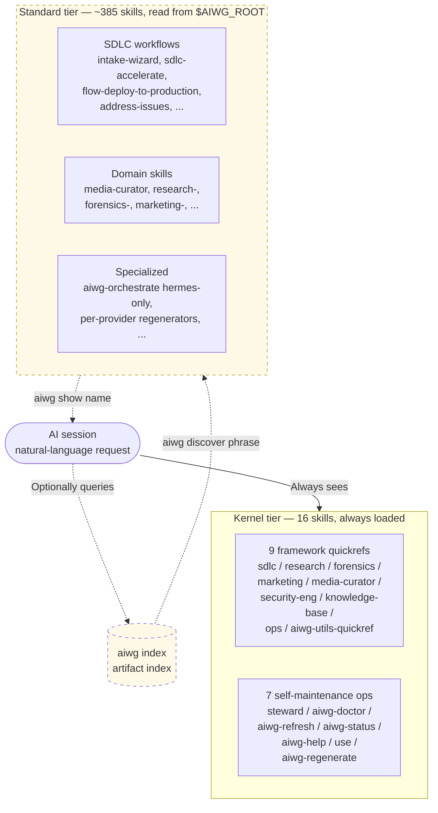
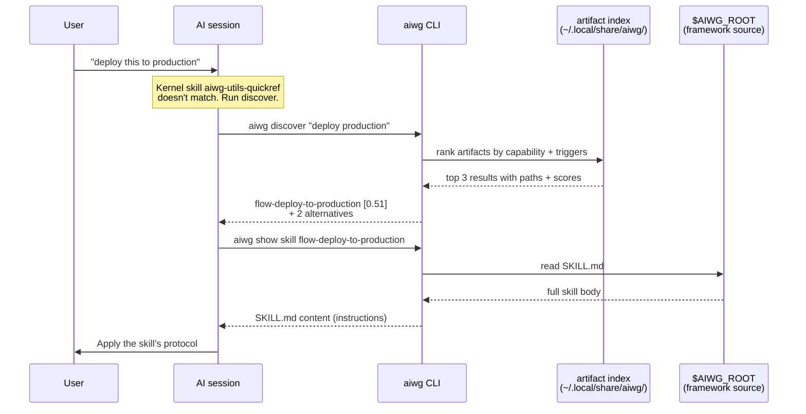

# Discovery and Kernel Skills — Best Practices

> **Version**: 2026.5.0+
> **Status**: Active — landed across all 10 supported providers
> **Reference**: epics [#1212](https://git.integrolabs.net/roctinam/aiwg/issues/1212), [#1217](https://git.integrolabs.net/roctinam/aiwg/issues/1217), [#1218](https://git.integrolabs.net/roctinam/aiwg/issues/1218); [`skill-discovery`](../agentic/code/addons/aiwg-utils/rules/skill-discovery.md) rule (HIGH)

## What changed and why

AIWG ships **400+ skills** across its frameworks. Agentic platforms (Claude Code, OpenClaw, Cursor, Codex, Factory, etc.) cap how many skills they will list in any given context — Claude Code at 25% of context window by default, OpenClaw at 150 hard, others on similar trajectories. The historical "deploy everything to the platform-native skills directory" pattern doesn't scale through these caps.

Starting in 2026.5.0, AIWG splits its skill surface into two tiers, with discovery + on-demand fetch closing the loop:

- **Kernel skills** — always-loaded into the platform's flat skill listing. ~16 skills total: 9 quickrefs (one per installed framework + utils), the `aiwg-language-map` for addons + extensions, and 6 self-maintenance ops.
- **Standard skills** — the other 380+ skills. Stay at `$AIWG_ROOT` and are **not copied per-project** by default (#1217). Reachable via `aiwg discover` (find) and `aiwg show` (fetch).

This document is the operator's guide to using the new model effectively, plus verification steps so you can confirm it's actually working.

## TL;DR

```bash
# Find what skill handles your need
aiwg discover "<the user's need, paraphrased>" --limit 3

# Fetch the full body of a specific skill / agent / command / rule
aiwg show skill <name>
aiwg show agent <name>
aiwg show command <name>
aiwg show rule <name>

# Health check
aiwg doctor
```

If the kernel quickref or the always-loaded ops skills don't already answer the question, run `aiwg discover`. Surface the top match (or top-3) to the user. Use `aiwg show` to read the file content without navigating storage paths yourself.

## ⚠ Discover-First Protocol (rc.41+)

For any user request mentioning **AIWG**, framework names (sdlc, research, forensics, ops, security-engineering, knowledge-base, marketing, media-curator), or capability keywords (skill, agent, rule, command, addon, workflow, template), `aiwg discover` MUST be the first information-gathering tool call.

Filesystem `Grep`/`Glob`/`Read` against any provider artifact directory (`.claude/`, `.codex/`, `.factory/`, `.warp/`, `.cursor/`, `.windsurf/`, `.opencode/`, `.github/`, `~/.hermes/`, `~/.openclaw/`, or `agentic/code/`) for AIWG-related lookups is **forbidden** until discover has been consulted at least once in the current session.

**Why this is a strict rule (issue [#1249](https://git.integrolabs.net/roctinam/aiwg/issues/1249))**: a literal-string grep hits 1-10 files; `aiwg discover` returns the indexed ranking across all 400+ artifacts. A Factory droid user reported going straight to `Grep "rlm"` for an AIWG question, hitting `rlm-agent.md` by literal match, and missing 8 other RLM-related skills, rules, and templates that discover would have surfaced. Rule 1.5 in `skill-discovery.md` codifies this discipline.

**When the platform supports subagent delegation** (Claude Code's `Task` tool, Hermes's `delegate_task`, Factory's droid spawn), prefer the `aiwg-finder` subagent over self-service `aiwg discover` + `aiwg show`. The finder agent runs the lookup in its own context and returns the selected artifact body plus a one-paragraph capability summary — ~200 parent tokens vs. ~3,000-8,000 for inline discover+show.

```bash
# Self-service (works on every platform)
aiwg discover "deploy production" --limit 3
aiwg show skill flow-deploy-to-production

# Delegated (Claude Code Task tool example; symmetric on Hermes/Factory)
Task(subagent_type="aiwg-finder", prompt="find the skill for deploying production")
```

You may skip the discover query only when: the user named a specific skill (`/flow-deploy-to-production`); the capability is clearly outside AIWG's scope (general programming, weather, translation); or you've already queried for the same need in the current session.

## How the two-tier model works





The two-tier model below describes the deployed layout; the diagrams above show how an agent actually navigates it.

```
Source of truth ($AIWG_ROOT/agentic/code/...)
│
│  ┌────────────────────────────┐
├─►│ KERNEL skills              │  copied per-project to platform-native skills dir
│  │ kernel: true in frontmatter│  always-loaded into agent context
│  │ (~16 skills today)         │  budget-bound; keep tight
│  └────────────────────────────┘
│
└─►┌────────────────────────────┐
   │ STANDARD skills            │  NOT copied (#1217 default)
   │ kernel: false / unset      │  agent reads from $AIWG_ROOT via `aiwg show`
   │ (~385 skills today)        │  reached through `aiwg discover`
   └────────────────────────────┘

           ▲                              ▲
           │                              │
   `aiwg use sdlc`                `aiwg discover "..."`
    deploys both tiers           returns absolute paths
    (kernel copies, standard     anchored to $AIWG_ROOT
    skipped by default)          → `aiwg show skill <name>`
```

### Why no-copy for standard skills?

Three reasons (#1217):

1. **No stale copies.** When AIWG updates, every project sees the new content immediately. No drift between `$AIWG_ROOT` and per-project mirrors.
2. **No bloat.** A typical AIWG install at `$AIWG_ROOT` is one tree. With the old per-project copy, every project carried 391 redundant skill files. Across 20 projects that's 20× duplication of the same content.
3. **Consistent with the budget pivot.** Standard skills are *not* in the platform's flat scan anyway. Whether they live at `<provider>/.aiwg/skills/` or stay at `$AIWG_ROOT/agentic/code/...` makes no difference to the platform — but it makes a big difference to disk and freshness.

### Opting back in to per-project copies

Some workflows still want the per-project mirror — sandboxed runtimes where `$AIWG_ROOT` isn't readable, air-gapped corpora, etc.

```bash
aiwg use sdlc --copy-all          # preferred — explicit CLI flag
aiwg use all --copy-all           # works for `aiwg use all` too
```

The `--copy-all` flag (alias `--copy-standard-skills`) restores the legacy copy behavior and writes all skills (kernel + standard) into the per-project tree at `<provider>/.aiwg/skills/` (and where applicable, `.agents/skills/`).

## The kernel set today (16 skills, ~15-25k tokens total)

### Framework quickrefs (9)

One quickref per framework, deployed when that framework is installed. Each one teaches the framework's mental model and lists curated `aiwg discover` phrases. They do **not** enumerate the full skill surface.

| Quickref | Framework |
|---|---|
| `sdlc-quickref` | sdlc-complete |
| `forensics-quickref` | forensics-complete |
| `research-quickref` | research-complete |
| `media-curator-quickref` | media-curator |
| `marketing-quickref` | media-marketing-kit |
| `ops-quickref` | ops-complete |
| `security-engineering-quickref` | security-engineering |
| `knowledge-base-quickref` | knowledge-base |
| `aiwg-utils-quickref` | aiwg-utils (always present) |

### Addon + extension language map (1)

| Quickref | Covers |
|---|---|
| `aiwg-language-map` | the ~270 skills across 28 addons + 7 ops extensions — capability domains, curated discover phrases, and a keyword→domain cheat sheet (#1227 follow-up) |

### Self-maintenance ops (6, new in rc.17)

These deploy regardless of framework. They exist so the agent retains *self-repair* surfaces even when discovery itself is broken (corrupted index, missing `$AIWG_ROOT`, etc.):

| Skill | Purpose |
|---|---|
| `steward` | Provider capability awareness + command routing |
| `aiwg-doctor` | Installation health check with remediation steps |
| `aiwg-refresh` | Update CLI + redeploy frameworks (alias: `aiwg sync`) |
| `aiwg-status` | Workspace status dashboard |
| `aiwg-help` | List every CLI command, arguments, and examples |
| `use` | Deploy a framework or addon |

These pair with the always-deployed `aiwg-steward` agent for orchestrated repair: status → doctor → refresh → re-doctor.

## The discover → show flow

```
┌─────────────────────────────────────────────────────────┐
│ User asks: "I need to deploy this to production"        │
└─────────────────────────────────────────────────────────┘
                          │
                          ▼
┌─────────────────────────────────────────────────────────┐
│ Agent: aiwg discover "deploy production"                │
│                                                         │
│   ★ score=0.51  skill   /home/.../flow-deploy-to-       │
│                          production/SKILL.md            │
│                          Orchestrate production deploy  │
│                          with strategy selection,       │
│                          validation, rollback ...       │
└─────────────────────────────────────────────────────────┘
                          │
                          ▼
┌─────────────────────────────────────────────────────────┐
│ Agent: aiwg show skill flow-deploy-to-production        │
│                                                         │
│   ---                                                   │
│   namespace: aiwg                                       │
│   name: flow-deploy-to-production                       │
│   ...                                                   │
│   ---                                                   │
│   # flow-deploy-to-production                           │
│   You orchestrate production deployments...             │
└─────────────────────────────────────────────────────────┘
                          │
                          ▼
                Agent applies the skill
```

Two-step pattern by design. **Discover** ranks candidates and returns metadata. **Show** fetches the full body without the agent having to navigate the filesystem. Consumers don't need to know where AIWG stores skills.

## Per-provider deployment paths

The kernel + standard split applies uniformly. All 10 providers honor the `--copy-all` flag for the standard tier.

| Provider | Kernel skills | Standard skills (when opt-in) | Cross-agent dump |
|---|---|---|---|
| Claude Code | `.claude/skills/` | `.claude/.aiwg/skills/` | — |
| Cursor | `.cursor/skills/` | `.cursor/.aiwg/skills/` | — |
| Factory AI | `.factory/skills/` | `.factory/.aiwg/skills/` | — |
| GitHub Copilot | `.github/skills/` | `.github/.aiwg/skills/` | — |
| Warp | `.warp/skills/` | `.warp/.aiwg/skills/` | — |
| Windsurf | `.windsurf/skills/` | `.windsurf/.aiwg/skills/` | — |
| Hermes | `~/.hermes/skills/` | `~/.hermes/.aiwg/skills/` | — |
| OpenCode | `.opencode/skill/` | `.opencode/.aiwg/skill/` | `.agents/skills/` |
| OpenClaw | `~/.openclaw/skills/aiwg/` | `~/.openclaw/.aiwg/skills/` | `.agents/skills/` |
| Codex | `~/.codex/skills/` | `~/.codex/skills/` (filtered) | `.agents/skills/` |

**Notes on the asymmetric providers:**

- **Codex** writes to `~/.codex/skills/` (home-dir, single tier). The deploy script filters by `kernel: true` by default, so only kernel skills land. Pass `--copy-all` to write the full set.
- **OpenCode** uses singular `.opencode/skill/` (platform convention). Cross-agent dump at `.agents/skills/` honors the same env-var filter.
- **OpenClaw** is user-scope only — pass `--scope user`, not `--target`. Kernel skills nest under `aiwg/` namespace at `~/.openclaw/skills/aiwg/` to avoid collisions with non-AIWG ClaWHub installs.

## Verifying it's working

After running `aiwg use <framework>`, here are the checks you can run.

### 1. Confirm the kernel set is what you expect

```bash
# For Claude Code
ls .claude/skills/
```

You should see the framework quickrefs and the 6 ops skills. Today's expected set for an `sdlc` install:

```
aiwg-doctor          aiwg-help            aiwg-refresh
aiwg-status          aiwg-utils-quickref  sdlc-quickref
steward              use
```

For `aiwg use all` (every framework), you'll see all 9 quickrefs + `aiwg-language-map` + 6 ops = 16 skills.

### 2. Confirm no per-project standard mirror by default

```bash
ls .claude/.aiwg/skills/ 2>&1
# expected: ls: cannot access '.claude/.aiwg/skills/': No such file or directory
```

If the directory exists with content, either you passed `--copy-all` (or set `

```bash
aiwg version
```

Should be `2026.5.0-rc.14` or later.

### 3. Confirm `aiwg discover` returns absolute paths

```bash
aiwg discover "deploy production" --limit 1 --json
```

Expected (path is anchored to `$AIWG_ROOT`):

```json
{
  "query": { "phrase": "deploy production", ... },
  "results": [
    {
      "path": "/home/you/.../aiwg/agentic/code/frameworks/sdlc-complete/skills/flow-deploy-to-production/SKILL.md",
      "type": "skill",
      ...
    }
  ]
}
```

If `path` is relative (`agentic/code/...`), check that `aiwg use` rebuilt the framework index — it should always rebuild post-deploy.

### 4. Confirm `aiwg show` reads from the indexed location

```bash
aiwg show skill flow-deploy-to-production | head -20
```

You should see the SKILL.md frontmatter + body streaming. If you get "no artifact found matching", run `aiwg discover` first to confirm the name and check `aiwg index stats --graph framework` to confirm the index is current.

### 5. Confirm `aiwg doctor` is green

```bash
aiwg doctor
```

The skill-listing budget check (per provider) should report well under the cap. For Claude Code with the default 25% budget on a 200k context, you should see something like:

```
[OK] Claude Code Skills        ~14k / 50k tokens (28%)
```

If the budget is exceeded, your kernel set has grown — only quickrefs + ops belong there.

### 6. Confirm self-repair surfaces are in context

In your agent session, ask the model:

> "Without running any commands, list the AIWG skills you currently have loaded."

You should see the 9 quickrefs and 6 ops skills enumerated. If only quickrefs appear, your install is on a pre-rc.17 version — run `aiwg refresh` to pick up the expanded kernel.

### 7. End-to-end: discover → show in one shot

```bash
# Find a skill
aiwg discover "intake wizard" --limit 1

# Read its body
aiwg show skill intake-wizard | head -10

# Read by JSON envelope (path + content)
aiwg show skill intake-wizard --json | jq -r .path
```

The `path` returned by show should match the `path` returned by discover — both anchored to `$AIWG_ROOT`.

## The rule that enforces this: `skill-discovery` (HIGH)

The aiwg-utils addon ships a HIGH-enforcement rule named `skill-discovery` that mandates the discovery query before declining a user request as "AIWG can't do that" or improvising a custom workflow. Full text: `agentic/code/addons/aiwg-utils/rules/skill-discovery.md`.

The rule lives next to `research-before-decision` (technical research) and `instruction-comprehension` (parsing the actual need). The three layer cleanly:

1. **`instruction-comprehension`** — parse what the user actually wants
2. **`skill-discovery`** — query the index for what AIWG already provides
3. **`research-before-decision`** — research the technical implementation if no skill matches

## Patterns that work

### Capability lookup with the user's own words

```bash
aiwg discover "deploy to production"
aiwg discover "audit our security"
aiwg discover "create an architecture decision record"
aiwg discover "scan this codebase to bootstrap an SDLC project"
```

Don't translate to AIWG vocabulary first — discovery is tuned for natural-language phrasing. The scorer looks at trigger phrases (declared in each skill's `## Triggers` section, weighted 4×), capability descriptions (2×), titles, tags, summaries, and paths.

### Type-narrowing for tighter results

```bash
aiwg discover "review code"          --type agent     # who handles code review
aiwg discover "deploy to production" --type skill     # the workflow
aiwg discover "no unauthenticated"   --type rule      # which rule enforces it
```

The default `--type` is `skill,agent,command,rule`. Narrowing helps when you specifically want one kind.

### JSON for sub-agent consumption

```bash
aiwg discover "deploy production" --json --limit 3
aiwg show skill flow-deploy-to-production --json
```

JSON output emits a stable schema, compact enough to forward to a subagent without context-bloat.

### Surface candidates to the user

When the top match is clear, name it:

> "I'll use `flow-deploy-to-production` for this — it orchestrates production deployment with strategy selection, validation, automated rollback, and regression gates."

When several are close, present them:

> "The index returns three candidates for that need:
> - `intake-wizard` — Generate or complete intake forms interactively
> - `intake-from-codebase` — Scan an existing codebase to scaffold intake
> - `intake-start` — Validate intake forms and kick off Inception
>
> Want me to use the wizard?"

This keeps your reasoning auditable and gives the user a chance to redirect.

## Anti-patterns

### "AIWG can't do that"

Without having queried first, this answer is likely wrong. The kernel set is intentionally tiny — most of AIWG's surface is invisible from a flat directory scan.

> ❌ "AIWG doesn't seem to have a deployment skill. Let me write a custom script..."
>
> ✅ *runs `aiwg discover "deploy production"`* → finds `flow-deploy-to-production`

### Enumerating from memory

The kernel quickrefs are pointer-heavy by design. Each one lists ~15–25 high-traffic skills. The framework's actual skill count is often 2–3× that. Enumerating from a quickref is enumerating from a curated subset — not the full surface.

> ❌ "The SDLC framework has these skills: [lists from sdlc-quickref's table]. Anything not in this list, AIWG can't do."
>
> ✅ "The SDLC framework's high-traffic skills are listed in `sdlc-quickref` — for `<specific need>`, let me check the index."

### Improvising when a curated skill exists

The curated skill encodes deliberate decisions — templates, gate criteria, multi-agent patterns, framework conventions. An ad-hoc improvisation will miss those.

> ❌ User asks for a Software Architecture Document → agent writes one from scratch
>
> ✅ User asks for a SAD → agent runs `aiwg discover "create SAD"` → finds `artifact-orchestration` + the SDLC architecture-evolution flow → invokes those, which apply the AIWG SAD template and multi-agent review pattern

### Reading skills by raw filesystem path

> ❌ Agent: "Let me cat `/home/.../agentic/code/frameworks/.../skills/intake-wizard/SKILL.md`"
>
> ✅ Agent: "Let me run `aiwg show skill intake-wizard`"

The CLI is the access point. It works the same regardless of where AIWG is installed (npm global, dev mode, custom corpus path) and survives layout changes.

### Filesystem-browsing after discover returned a path

This is the most common drift mode. Discovery succeeded, the path came back, and instead of running `aiwg show`, the agent reaches for `find` / `ls` / `Glob` to "locate the deployed copy."

> ❌ `aiwg discover "intake wizard"` → returns path → agent runs `find . -name "intake-wizard"` to "find a deployed copy"
>
> ❌ Agent: "The Skill tool says `aiwg:intake-wizard` doesn't exist. Let me grep for it."
>
> ✅ `aiwg discover "intake wizard"` → returns path → agent runs `aiwg show skill intake-wizard`

There is no "deployed copy to locate." Most AIWG skills aren't deployed per-project (no-copy default, #1217). The `aiwg show` command always fetches from the indexed location regardless of deploy state.

### Reaching for the filesystem when the platform Skill tool errors

The platform's Skill tool can only invoke kernel-listed skills directly. For everything else, it will error — that's expected behavior. The fallback is `aiwg show`, never filesystem traversal.

> ❌ Skill tool errors → agent runs `find` / `ls` / `Read` on `<provider>/skills/` paths
>
> ✅ Skill tool errors → agent runs `aiwg show <type> <name>` and applies the returned body

## Recovery when discovery itself breaks

The 6 self-maintenance ops kernel skills exist precisely for this case. If `aiwg discover` errors out:

1. **`aiwg-doctor`** — diagnose what's broken (missing `$AIWG_ROOT`, corrupted index, version mismatch, etc.)
2. **`aiwg-status`** — see what's currently deployed
3. **`aiwg-refresh`** — update CLI + redeploy frameworks
4. **`steward`** — get provider-specific routing advice
5. Re-run `aiwg discover` to confirm

The `aiwg-steward` agent (always-deployed alongside the framework agents) orchestrates this sequence end-to-end. Invoke it via `@aiwg-steward` in your platform's agent UI.

### Last-resort: read the canonical corpus directly

If even the kernel ops skills fail (e.g., catastrophic install corruption), the AIWG corpus at `$AIWG_ROOT/agentic/code/` is the canonical source of truth. It is always present at the install root and survives any deploy-state corruption.

| Asset type | Corpus path |
|---|---|
| Framework skill | `$AIWG_ROOT/agentic/code/frameworks/<framework>/skills/<name>/SKILL.md` |
| Addon skill | `$AIWG_ROOT/agentic/code/addons/<addon>/skills/<name>/SKILL.md` |
| Framework agent | `$AIWG_ROOT/agentic/code/frameworks/<framework>/agents/<name>.md` |
| Persona agent | `$AIWG_ROOT/agentic/code/agents/personas/<name>.md` |
| Framework rule | `$AIWG_ROOT/agentic/code/frameworks/<framework>/rules/<name>.md` |
| Addon rule | `$AIWG_ROOT/agentic/code/addons/<addon>/rules/<name>.md` |

Resolve `$AIWG_ROOT` from one of:
- `$AIWG_ROOT` environment variable
- `aiwg runtime-info` output (path field)
- `aiwg version` output (path field — always reports the resolved install root)

Reading the corpus directly is **only acceptable as a last resort**. The CLI is the right tool first; corpus paths are the safety net under it.

## Adding a kernel skill

When authoring a new skill that should be always-loaded (rare — the kernel set should stay small), opt in via SKILL.md frontmatter:

```yaml
---
name: my-quickref
namespace: aiwg
platforms: [all]
kernel: true
description: ...
---
```

Then deploy with `aiwg use <framework>`. The provider's `deploySkills` partitions by `kernel: true` and routes to the platform-native dir.

The bar for kernel-tier skills is high. Today's kernel falls into two categories — orientation (quickrefs) and self-repair (ops). Adding more dilutes both functions and burns budget.

## Backward compatibility

- `aiwg index discover` still works (same dispatch path). The top-level `aiwg discover` is the canonical surface.
- `aiwg index show <type> <name>` still works alongside the top-level `aiwg show <type> <name>`.
- `aiwg sync` is a deprecated alias for `aiwg refresh` — emits a warning, scheduled for removal after the 2026.5.x stable line.
- Pre-rc.14 installs will still find their skills under `<provider>/.aiwg/skills/` — `aiwg refresh` migrates to the new layout (deletes the legacy mirror) on next deploy.

## References

- CLI reference [Discovery section](cli-reference.md#discovery) — full command reference
- [`skill-discovery`](../agentic/code/addons/aiwg-utils/rules/skill-discovery.md) — HIGH-enforcement framing rule
- Epic [#1212](https://git.integrolabs.net/roctinam/aiwg/issues/1212) — index-driven skill discovery
- Epic [#1217](https://git.integrolabs.net/roctinam/aiwg/issues/1217) — no-copy default
- Epic [#1218](https://git.integrolabs.net/roctinam/aiwg/issues/1218) — `aiwg show` companion to discover
- [`aiwg-utils-quickref`](../agentic/code/addons/aiwg-utils/skills/aiwg-utils-quickref/SKILL.md) — kernel utility quickref that surfaces this discipline
- [Architecture audit](../.aiwg/architecture/audit-index-subsystem-2026-05.md) — index subsystem audit that produced the 450-LOC implementation path
- [Provider landscape research](../.aiwg/research/findings/skill-budget-landscape-2026-05.md) — survey of skill-budget caps across the 10 supported providers
