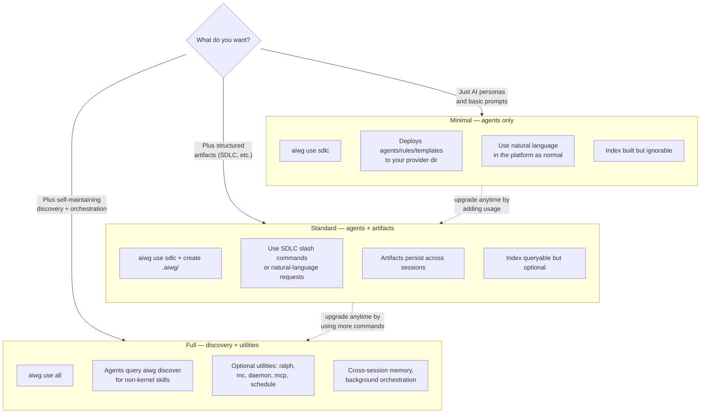

# How AIWG Works

A practical guide to understanding what AIWG does under the hood. No prior knowledge assumed.

> **Want the visual version first?** See [`docs/architecture-overview.md`](architecture-overview.md) for diagram-led explanations of the same concepts below. It pairs MermaidJS diagrams (rendered inline) with placeholders for polished illustrations — useful if you build the mental model better from a picture than from prose.

## What Problem Does AIWG Solve?

AI coding assistants are powerful, but they start every session with amnesia. They don't know your project's architecture, your team's conventions, or what happened yesterday. AIWG solves this by injecting persistent context — agents, rules, workflows, and project state — directly into the directories your AI assistant reads on startup.

The result: your AI assistant behaves like a team member who has read all the documentation, follows your standards, and remembers where the project left off.

## 1. The Injection Model

When you run `aiwg use sdlc`, AIWG copies a set of files into your project. These files are placed in directories that your AI assistant automatically reads.

```mermaid
flowchart LR
  subgraph Source["AIWG framework source"]
    direction TB
    KERN[16 kernel skills<br/>~15-25k tokens]
    STD[~385 standard skills<br/>read from $AIWG_ROOT]
    AGENT[200+ agents]
    RULES[60+ rules]
    TPL[100+ templates]
  end

  CLI([aiwg use sdlc<br/>--provider X]) --> DEPLOY

  subgraph DEPLOY["Deploy step (one-shot)"]
    direction TB
    COPY[Copy kernel skills, agents,<br/>rules to provider-native dirs]
    INDEX[Build artifact index<br/>~/.local/share/aiwg/index/]
    CTX[Emit AIWG.md + AGENTS.md<br/>at project root]
  end

  Source --> CLI
  DEPLOY --> Project

  subgraph Project["Your project (after deploy)"]
    direction TB
    PLAT[.claude/skills/<br/>.codex/agents/<br/>.warp/agents/ ...]
    AIWGMD[AIWG.md / .hermes.md /<br/>WARP.md / AGENTS.md]
    ART[.aiwg/<br/>requirements/<br/>architecture/<br/>...]
  end

  Project --> SESS

  subgraph SESS["AI session (Claude / Codex / Hermes / etc.)"]
    direction TB
    NATIVE[Platform-native loader<br/>reads provider dir]
    DISC([Optional: aiwg discover<br/>+ aiwg show])
  end

  classDef optional stroke-dasharray: 5 5,fill:#fef9e7
  class DISC optional
  class INDEX optional
```




### What Gets Deployed

AIWG deploys four types of artifacts:

| Artifact | What It Does | Example |
|----------|-------------|---------|
| **Agents** | Specialized AI personas with defined expertise | "Test Engineer" agent that knows testing patterns |
| **Commands** | Slash commands the AI can execute | `/issue-list` to show open tickets |
| **Skills** | Reusable workflows triggered by natural language | Saying "run security review" activates the security skill |
| **Rules** | Behavioral constraints the AI follows automatically | "Never delete tests to make them pass" |

### Where Files Go

Different AI platforms look for context in different places. AIWG handles this automatically:

```
Claude Code    →  .claude/agents/    .claude/commands/    .claude/skills/    .claude/rules/
GitHub Copilot →  .github/agents/    .github/agents/      .github/skills/    .github/copilot-rules/
Cursor         →  .cursor/agents/    .cursor/commands/    .cursor/skills/    .cursor/rules/
Factory AI     →  .factory/droids/   .factory/commands/   .factory/skills/   .factory/rules/
```

The same framework source gets transformed into the right format for each platform. You write once; AIWG deploys everywhere.

### How Deployment Works

```
┌─────────────────────┐
│  Framework Source    │    agentic/code/frameworks/sdlc-complete/
│  (lives in AIWG)    │    ├── agents/   (93 agent definitions)
│                     │    ├── commands/ (95 commands)
│                     │    ├── skills/   (skill definitions)
│                     │    └── rules/    (33 behavioral rules)
└────────┬────────────┘
         │  aiwg use sdlc
         ▼
┌─────────────────────┐
│  Your Project       │    your-project/
│  (provider-specific │    ├── .claude/agents/     ← if using Claude
│   directories)      │    ├── .claude/commands/
│                     │    ├── .claude/skills/
│                     │    └── .claude/rules/
└─────────────────────┘
```

## 2. Tools That Build Memory By Design

AIWG gives your AI assistant operational tools — rules, commands, skills, and agents — that help you manage your project and build things. These tools are deliberately designed to produce **structured, semantically organized artifacts** in the `.aiwg/` directory. This isn't a side effect — it's the core design principle.

Research shows why this matters. MetaGPT (Hong et al., 2024) demonstrated that requiring agents to produce structured intermediate artifacts — requirements documents, design specs, interface definitions — rather than unstructured dialogue dramatically improves outcomes: 85.9% pass rate vs. 67% for unstructured approaches. The structured outputs become context that subsequent agents can build on reliably.

AIWG applies this principle at the project level. Every tool is designed so that doing useful work also produces well-organized memory that future sessions can consume.

### Rules: Behavioral Guardrails

Rules keep the AI consistent across sessions. They're constraints the AI follows every time it works in your project.

Some rules are always active:
- **No attribution** — Never add "Generated with AI" to commits or code
- **Token security** — Never hardcode API tokens
- **Anti-laziness** — Never delete tests to make them pass

Other rules activate based on context. When the AI edits files in `src/`, development-specific rules load. When it edits markdown files, writing quality rules load. This is called **path-scoped activation**.

### Commands and Skills: Getting Things Done

Commands are explicit actions you invoke — `/address-issues`, `/commit-and-push`, `/security-audit`. Skills work the same way but activate from natural language instead of slash syntax.

For example, saying "run a security review" activates the security audit skill, which:
1. Scans the codebase for common vulnerabilities
2. Checks dependencies for known CVEs
3. Reviews authentication and authorization patterns
4. Generates a findings report saved to `.aiwg/security/`

The AI doesn't need to be told the steps — the skill encodes the entire workflow. And the output — the findings report, the threat model, the test plan — is deliberately structured and placed in `.aiwg/` where future sessions will find it. This follows the same principle as Retrieval-Augmented Generation (Lewis et al., 2020): grounding AI responses in retrievable external knowledge rather than relying on the model's parametric memory alone.

### Agents: Specialized Personas

Agents give the AI a specific expertise profile. When a "Test Engineer" agent is active, the AI:
- Has access to testing-specific tools
- Follows testing conventions and patterns
- Knows how to write different types of tests (unit, integration, e2e)
- References testing documentation

Think of agents as job descriptions for the AI — they define what the AI knows and what tools it can use for a specific role.

### Purposeful Memory Architecture

The memory in `.aiwg/` is semantically laid out by design. Requirements go in `requirements/`, architecture decisions in `architecture/`, risks in `risks/`. Each artifact uses structured formats with cross-references — requirements trace to use cases, tests reference the requirements they verify, architecture decisions link to the risks they mitigate.

This organization matters because it enables what Reflexion (Shinn et al., 2023) demonstrated at the agent level: systems that maintain structured episodic memory and learn from accumulated experience dramatically outperform those that start fresh each time. At the project level, `.aiwg/` serves the same function — it's the project's episodic memory, and each session builds on everything that came before.

The traceability research (Gotel & Finkelstein, 1994) established that the most critical gap in software projects is tracing artifacts back to their origins — the *why* behind decisions. AIWG's `@-mention` system and structured artifact relationships address this directly, creating a web of linked knowledge that answers not just "what" but "why."

## 3. The Prompt Architecture

### Platform Context Files

Every AI platform has a file that serves as the AI's "project memory." AIWG configures these files during deployment:

| Platform | Context File | Purpose |
|----------|-------------|---------|
| Claude Code | `CLAUDE.md` | Project instructions loaded every session |
| Windsurf | `AGENTS.md` | Agent definitions and project context |
| Cursor | `.cursorrules` | Editor-level behavior rules |
| Warp Terminal | `WARP.md` | Terminal-aware project context |

These files contain:
- Project structure overview
- Available commands and agents
- Core behavioral rules (summarized for fast loading)
- Links to detailed documentation (loaded on demand)

### Always-Loaded vs On-Demand

Not everything loads at once — that would overwhelm the AI's context window. AIWG uses a two-tier loading strategy:

**Always loaded** (compact summaries):
- Project overview and structure
- Core rules (no-attribution, token-security, anti-laziness)
- Available commands and agents (names only)

**Loaded on demand** (full details):
- Individual agent expertise profiles
- Detailed rule enforcement instructions
- Architecture and requirements documents

On-demand loading happens through `@`-mentions. When the AI sees `@.aiwg/architecture/sad.md` in a conversation, it loads that specific document for context.

## 4. Hooks and Flows

### Hooks: Event-Driven Actions

Hooks fire automatically when specific events occur:

| Event | When It Fires | What It Does |
|-------|--------------|-------------|
| Pre-session | AI session starts | Loads project state, checks for updates |
| Post-write | AI writes a file | Validates formatting, runs linters |
| Pre-commit | Before git commit | Enforces commit conventions |

Hooks are the automation layer — they handle routine checks without anyone asking.

### Flows: Multi-Step Workflows

Flows orchestrate complex multi-step processes. The SDLC framework includes flows for each development phase:

```
Concept → Inception → Elaboration → Construction → Transition
```

Each flow:
1. **Reads a template** that defines the steps, agents, and gates
2. **Coordinates multiple agents** — for example, a requirements phase might use a Requirements Analyst to write specs, a Security Architect to review threats, and a Test Architect to define test strategy
3. **Enforces quality gates** — human approval required before advancing to the next phase

### The Agent Coordination Pattern

When multiple agents work together, they follow a structured pattern:

```
Primary Author  →  writes the artifact
       ↓
Parallel Reviewers  →  review from different perspectives
       ↓
Synthesizer  →  merges feedback into the final version
       ↓
Archivist  →  stores the artifact with metadata
```

This mimics how human teams work: one person drafts, others review, someone incorporates feedback, and the result gets filed.

## 5. The `.aiwg/` Directory as Project State

The `.aiwg/` directory is where AIWG stores your project's living documents:

```
.aiwg/
├── intake/           # Project intake forms and scope
├── requirements/     # Use cases, user stories, acceptance criteria
├── architecture/     # System architecture, design decisions (ADRs)
├── planning/         # Phase plans, iteration plans
├── risks/            # Risk register and mitigations
├── testing/          # Test strategy and test plans
├── security/         # Threat models, security gates
├── deployment/       # Deployment plans, runbooks
├── reports/          # Generated status reports
└── frameworks/       # Registry of installed frameworks
    └── registry.json # Tracks what's deployed
```

### The Intake Process: Seeding the Memory

A fresh `.aiwg/` directory is empty — there's no memory yet. The **intake process** is how you establish the initial set.

You can start intake in several ways:
- `/intake-wizard "Build a customer dashboard"` — generate intake from a project description
- `/intake-from-codebase .` — analyze an existing codebase and generate intake from what's already there
- Fill out the templates manually and run `/intake-start` to validate them

However you start, AIWG walks through structured questions about your project: what problem you're solving, who it's for, what constraints exist, what testing strategy to use, what non-functional requirements matter (security posture, scale expectations, compliance needs).

The answers become your first artifacts — a **project intake form** (problem, scope, constraints, testing strategy), a **solution profile** (technical approach, architecture preferences), and an **option matrix** (trade-offs between alternatives). These documents land in `.aiwg/intake/` and seed the project memory with enough context that every subsequent AI session understands the project from the start.

Without intake, the AI has tools but no project knowledge. With intake, it has both — and every phase that follows (requirements, architecture, testing) builds on that foundation rather than starting from scratch.

This is why intake matters even if you're eager to start coding. The time spent answering intake questions saves hours of re-explaining context across future sessions.

### Why This Matters

When a new AI session starts, it reads `.aiwg/` to understand:
- What phase the project is in
- What requirements exist
- What architecture decisions have been made
- What risks have been identified
- Where the last session left off

This creates **continuity across sessions**. The AI doesn't start from zero — it picks up where the last session stopped.

### The Framework Registry

`.aiwg/frameworks/registry.json` tracks which frameworks and addons are installed:

```json
{
  "frameworks": {
    "sdlc-complete": {
      "version": "2026.1.5",
      "installed_at": "2026-01-15T10:00:00Z",
      "provider": "claude"
    }
  }
}
```

This prevents duplicate deployments and enables version tracking.

## 6. Putting It All Together

Let's walk through what happens when a user says **"transition to elaboration"** in a project with AIWG installed.

### Step 1: Natural Language Recognition

The SDLC orchestration rule (always loaded) recognizes this as a phase transition request. It maps the phrase to the `flow-inception-to-elaboration` flow template.

### Step 2: Read Flow Template

The flow template defines:
- **Entry criteria**: What must be complete before elaboration starts (intake form, initial requirements)
- **Agents involved**: Architecture Designer, Requirements Analyst, Test Architect, Security Architect
- **Artifacts to produce**: Software Architecture Document, ADRs, refined requirements, test strategy
- **Exit criteria**: All artifacts reviewed and approved

### Step 3: Verify Entry Criteria

The orchestrator checks `.aiwg/` to verify prerequisites:
- Does `.aiwg/intake/` contain a completed intake form?
- Are initial requirements documented?
- Has the previous phase been formally completed?

If criteria aren't met, the system reports what's missing.

### Step 4: Agent Coordination

The orchestrator launches agents in sequence:

1. **Architecture Designer** creates the initial architecture document
2. **Security Architect** reviews for threats and creates a threat model
3. **Requirements Analyst** refines requirements based on the architecture
4. **Test Architect** defines the test strategy

Each agent follows the Primary Author → Reviewers → Synthesizer pattern.

### Step 5: Quality Gate

Before the transition completes, a human review gate activates:
- Shows a summary of all artifacts produced
- Highlights key decisions that need approval
- Requires explicit human sign-off to proceed

### Step 6: State Update

On approval, `.aiwg/` is updated:
- New artifacts are saved to their respective directories
- The project phase marker advances to "elaboration"
- The next session will know the project is in the elaboration phase

### The Cumulative Effect

Over time, `.aiwg/` accumulates institutional knowledge:
- Requirements trace back to user stories
- Architecture decisions link to the requirements they satisfy
- Tests reference the requirements they verify
- Risks connect to the components they affect

This web of linked artifacts means the AI can answer questions like "what tests cover requirement UC-001?" or "what risks affect the authentication module?" by traversing the relationships.

## What's Optional

Not every team needs every AIWG feature. AIWG ships in three configuration tiers — pick the one that matches your appetite. Upgrade later (or downgrade) at will.



Most users live in Minimal or Standard. Full exists for power users who want background orchestration, autonomous loops, and cross-session memory — but those features only run when you invoke them.

## Key Takeaways

1. **AIWG is an injection system** — it deploys context files into directories your AI reads
2. **Tools are designed to produce memory** — rules, commands, skills, and agents help you build while deliberately generating structured, traceable artifacts in `.aiwg/`
3. **The intake process seeds the memory** — structured questioning establishes the initial project context that every future session builds on
4. **Flows coordinate agents** — multi-step processes with quality gates
5. **It works across platforms** — same framework, adapted for Claude, Copilot, Cursor, and more
6. **Adoption is gradual** — Minimal/Standard/Full tiers let you scale your AIWG footprint to match the project

The net effect: your AI assistant goes from a capable but forgetful tool to a knowledgeable team member that follows your standards, builds real artifacts, and accumulates structured project knowledge that compounds across every session.
