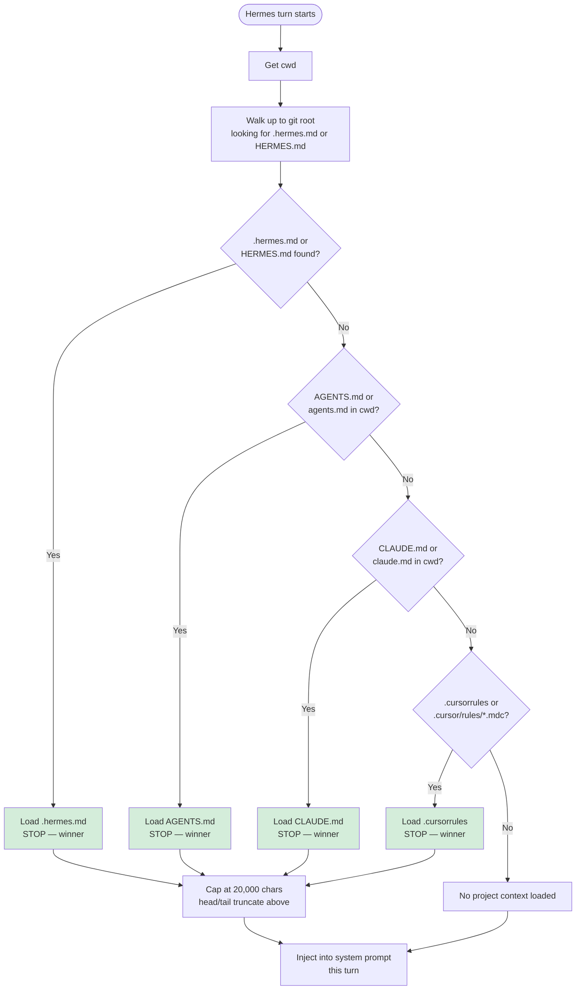

# Hermes Agent Quick Start

Integrate AIWG with [Hermes Agent](https://github.com/NousResearch/hermes-agent) as an MCP sidecar.

> **This is not a traditional provider deployment.** Unlike other AIWG integrations where `aiwg use sdlc --provider X` deploys artifacts into the provider's directory structure, Hermes has its own memory management model. AIWG runs as an external MCP server that Hermes calls — the architecture is `Hermes → MCP → AIWG`.

---

## Architecture

The AIWG–Hermes seam is a single MCP connection. Hermes can sit upstream of any messaging platform or editor that Hermes itself supports — AIWG doesn't need to know about those upstream surfaces.

```
[Terminal / Telegram / Discord / Signal / Slack / Mattermost / Matrix / Zed (via ACP)]
                                  │
                                  ▼
                        Hermes Agent (host)
                          ├── Conversation, memory (MEMORY.md/USER.md), sessions
                          ├── Built-in tools (40+) and slash commands (65+)
                          ├── Skills (~/.hermes/skills/)
                          ├── /kanban (built-in agent task board)
                          ├── /handoff (cross-platform session transfer)
                          └── MCP connection
                                └── AIWG MCP Server (sidecar)
                                      └── .aiwg/ artifacts, workflows, templates
```

**Hermes owns**: conversation flow, persistent memory (MEMORY.md, USER.md), session history (state.db), user model, skills, in-session task tracking (kanban), platform handoff, scheduled tasks (`/cron`).

**AIWG owns**: workflow execution, artifact output in `.aiwg/`, template rendering, agent definitions, persistent SDLC artifacts.

**MCP is the seam.** Coexistence with clear boundaries — not system unification. AIWG does not need to know which platform a Hermes turn originated from; Hermes does not need to know how AIWG produces an artifact.

### Recommended Model Strategy

Two roles, two models. The parent agent handles conversation; coding tasks are delegated with a model override.

#### Conversation & Soul (parent agent)

| Model | Size | Notes |
|---|---|---|
| `hermes3` ⭐ | 8B | Purpose-built for roleplay, persistent memory, character — ideal for soul features |
| `llama3.2:3b` | 3B | Lightweight option; fast on CPU or low VRAM |
| `mistral:7b` | 7B | Solid general-purpose conversation |
| `gemma2:9b` | 9B | Strong nuanced dialogue, good at following persona instructions |

#### Coding & Tool Calls (delegation model)

> **Qwen models have the best tool call accuracy of any open-weight family.** For AIWG workflows involving structured output, function calling, or code generation, Qwen should be the first choice.

| Model | Size | Notes |
|---|---|---|
| `qwen2.5-coder:14b` ⭐ | 14B | Best tool call accuracy + coding quality; recommended for AIWG workflows |
| `qwen2.5-coder:7b` | 7B | Smaller Qwen coding variant; excellent tool calls, lower VRAM |
| `qwen3.5:9b` | 9B | Vision + 256K context; strong structured output and tool calls (8GB VRAM) |
| `qwen3:8b` | 8B | Strong structured output; supports thinking/non-thinking modes |
| `phi4-mini` | 3.8B | Microsoft; compact, strong at structured reasoning |
| `deepseek-coder-v2:16b` | 16B | Strong coding quality; needs 16GB+ VRAM |

```bash
# Pull both recommended models
ollama pull hermes3
ollama pull qwen2.5-coder:14b
```

Configure delegation model in `~/.hermes/config.yaml` under `delegation.model: "ollama/qwen2.5-coder:14b"` to route coding-heavy AIWG workflows to the coding model while keeping the parent conversation on `hermes3`.

---

## What's New in v0.4.0

This guide targets Hermes Agent v0.4.0+. Key changes relevant to AIWG integration:

| Feature | Description |
|---|---|
| **`hermes mcp` CLI** | Install and manage MCP servers via CLI — no manual config editing required |
| **`hermes tools` TUI** | Interactive tool configuration interface |
| **Real-time config reload** | Edit `~/.hermes/config.yaml` and changes apply immediately — no restart |
| **`${ENV_VAR}` substitution** | Use environment variables in config values |
| **`custom_models.yaml`** | Add user-managed models without editing the main config |
| **CLAUDE.md recognition** | Hermes now loads `CLAUDE.md` as a context file alongside `AGENTS.md` |
| **Delegation improvements** | `provider` and `model` now configurable per subagent; thread-safe concurrent delegation |
| **New platform adapters** | Signal, DingTalk, SMS (Twilio), Mattermost, Matrix, Webhook, OpenAI-compatible API server |
| **New inference providers** | GitHub Copilot (OAuth 2.1 PKCE), Alibaba DashScope, Kilo Code, OpenCode Zen/Go |

See [Hermes v0.4.0 release notes](https://hermes-agent.nousresearch.com/changelog) for the full changelog.

---

## Prerequisites

- Hermes Agent installed ([installation guide](https://hermes-agent.nousresearch.com/docs))
- AIWG installed (`npm install -g aiwg`)
- Local models via Ollama: `hermes3` (conversation, soul features) and `qwen2.5-coder:14b` (coding tasks)
- A project directory with source code

---

## Part 1: Verify Both CLIs Independently

Before connecting, confirm both work on their own.

**Verify Hermes:**

```bash
hermes --version
# Start a test conversation to confirm model connection
hermes chat "Hello, what model are you?"
```

**Verify AIWG:**

```bash
aiwg version
aiwg mcp info    # Confirm MCP server is available
```

---

## Part 2: Connect AIWG to Hermes via MCP

Add the AIWG MCP server to Hermes configuration.

**Option A — CLI add (v0.4.0+, recommended):**

```bash
hermes mcp add aiwg --command aiwg --args mcp serve
```

This appends an entry to `~/.hermes/config.yaml` automatically. Verified against Hermes source `hermes_cli/main.py:10860-10895`: the mcp subcommand surface is `serve | add | remove | list | test | configure` — no `install` subcommand. `--args` is `nargs="*"`, so pass tokens space-separated (`mcp serve`), not comma-separated.

In an active chat, run `/reload-mcp` after adding to pick up the new server without restarting the session.

**Option B — Manual config edit:**

Edit `~/.hermes/config.yaml`:

```yaml
mcp_servers:
  aiwg:
    command: "aiwg"
    args: ["mcp", "serve"]
```

After saving, run `/reload-mcp` in your active Hermes chat to apply.

**Why this is lean by default:** AIWG's MCP server exposes exactly 5 tools (`workflow-run`, `artifact-read`, `artifact-write`, `template-render`, `agent-list`) — no more. This keeps the schema footprint to ~3,000 tokens. No tool whitelisting is needed because the server surface is already minimal.

**Verify:**

```bash
hermes chat "What AIWG tools are available?"
```

Hermes should list the 5 AIWG tools.

---

## Part 3: Add Routing Guidance (AGENTS.md)

Create an `AGENTS.md` at your project root that tells Hermes when to call AIWG.

> **First-match-wins context loading** (verified against `agent/prompt_builder.py:1410-1436`). Hermes loads exactly **one** project-context file per turn, by priority:
>
> 1. `.hermes.md` / `HERMES.md` (walks up to git root)
> 2. `AGENTS.md` / `agents.md` (cwd only, no walk)
> 3. `CLAUDE.md` / `claude.md` (cwd only, no walk)
> 4. `.cursorrules` / `.cursor/rules/*.mdc` (cwd only)
>
> The code comment is explicit: *"Priority (first found wins — only ONE project context type is loaded)."* Earlier docs that suggested Hermes loads `AGENTS.md` and `CLAUDE.md` together were aspirational. AIWG always emits a `.hermes.md` twin file (#1239 / #1242), so when this integration is installed, `AGENTS.md` and `CLAUDE.md` never load on Hermes turns — they remain valid context files for Claude Code, Codex, etc., but are silent on Hermes.




> **Each context source is capped at 20,000 chars** (`CONTEXT_FILE_MAX_CHARS` in `agent/prompt_builder.py:1284`). Above that, head/tail truncation kicks in with a marker noting the cut. The thin `.hermes.md` AIWG emits (~930 bytes) is well under the cap.

> **Token budget reminder:** even within the 20K cap, Hermes loads context in full on every turn. Keep routing guidance compact — AIWG's default `.hermes.md` is ~230 tokens.

**Create `AGENTS.md` in your project root:**

```markdown
# AIWG Integration

AIWG connected via MCP (`aiwg mcp serve`). Tools: workflow-run, artifact-read,
artifact-write, template-render, agent-list.

## Route to AIWG When

- Structured artifacts needed (requirements, architecture, test plans, risk registers)
- Multi-step workflows with phase gates or checkpoints
- Template-driven output that persists across sessions

Handle in Hermes directly: one-off questions, short tasks, conversation.

## Memory Boundary

When AIWG returns an artifact: store path + one-sentence summary in MEMORY.md.
Do NOT copy artifact body text into memory. Reference, don't replicate.

Use `delegate_task(goal="...", context="...")` for AIWG workflows.
Child agents automatically exclude context files and memory.

## Artifact Store (.aiwg/)

Fetch on demand via `artifact-read`:
- `requirements/` — use cases, user stories
- `architecture/` — SAD, ADRs
- `planning/` — phase plans
- `testing/` — test strategy
- `security/` — threat models
```

A template is available at `agentic/code/frameworks/sdlc-complete/templates/hermes/AGENTS.md.aiwg-template`.

---

## Part 4: Run Your First Workflow

Ask Hermes to create a structured artifact that routes through AIWG.

**Example prompt:**

```
Create an architecture decision record for choosing PostgreSQL over MongoDB
for our user service. Save it as a persistent AIWG artifact.
```

**What should happen:**

1. Hermes reads the routing rules in `.hermes.md` (or `AGENTS.md` as fallback per Part 3)
2. Hermes calls `workflow-run` or `artifact-write` via MCP
3. AIWG creates the artifact in `.aiwg/architecture/`
4. Hermes receives the result and stores a reference

**Verify:**

```bash
ls .aiwg/architecture/
# Should show the new ADR file
```

### Composing with Hermes session features

Once Part 4 works, you can chain AIWG calls with Hermes's session-management commands. None of these require AIWG configuration — they work on top of the MCP seam.

**Hand the session off to mobile** (`/handoff <platform>` — landed in Hermes #23400, source: `gateway/run.py:_process_handoff`):

```
You: Create the inception use cases for our auth feature, then I'll review on the train.
Hermes: <runs aiwg-orchestrate to file UC-001..UC-004 in .aiwg/requirements/>
You: /handoff telegram
Hermes: ✓ Session transferred. Continue from your phone.
```

The chat continues on Telegram (or Discord, Signal/SMS via Twilio, Mattermost, Matrix, etc. — any gateway platform Hermes supports). Mobile messages route back to the same Hermes session, which still holds the AIWG MCP connection.

**Run an AIWG workflow in the background** (`/background <prompt>` aliases `/bg`, `/btw`):

```
/bg use aiwg-orchestrate to draft the SAD for the payment service
```

The prompt runs without blocking your foreground chat. Use `/agents` (alias `/tasks`) to check progress.

**Set a standing AIWG goal** (`/goal "<text>"`):

```
/goal Complete SDLC inception phase by EOW — file all use cases, ADRs, risk register
```

Hermes carries this across turns and proactively triggers AIWG workflows toward the goal. Pause/resume/clear with `/goal pause | resume | clear | status`.

---

## Part 5: State Boundaries

Hermes and AIWG each own distinct state. Do not synchronize them.

| Owned by Hermes | Owned by AIWG |
|---|---|
| `~/.hermes/memories/MEMORY.md` | `.aiwg/requirements/` |
| `~/.hermes/memories/USER.md` | `.aiwg/architecture/` |
| `~/.hermes/state.db` (sessions) | `.aiwg/planning/` |
| `~/.hermes/skills/` | `.aiwg/testing/` |
| Conversation context | `.aiwg/security/` |

**The contract:** Exchange references, not synchronized databases. Hermes stores a path and summary; AIWG stores the full artifact.

---

## Part 6: aiwg-orchestrate Skill (auto-installed)

After Part 4, AIWG ships a convenience skill that uses `delegate_task` to keep AIWG workflows out of the parent context.

**Why:** Direct MCP calls add 3,000-8,000 tokens to the parent context per workflow. `delegate_task` reduces this to ~200 tokens — a 95% reduction.

> **#1242 update**: Since 2026.5.0+ `aiwg use --provider hermes` automatically installs this skill at `~/.hermes/skills/aiwg-orchestrate/SKILL.md` on first deploy. The install is idempotent — your edits are preserved across subsequent `aiwg use` runs. The Hermes provider's prune-stale-skills sweep treats `aiwg-orchestrate` as part of the kernel set so it survives reruns.

> **API note (v0.4.0):** `delegate_task` automatically excludes context files (AGENTS.md, SOUL.md) and memory (MEMORY.md, USER.md) from child agents — this is hardcoded behavior, not a per-call parameter. The delegation model is configured globally in `~/.hermes/config.yaml` under `delegation.model`.

**To verify the install:** `ls ~/.hermes/skills/aiwg-orchestrate/SKILL.md`

**To re-install** (after deletion or to reset to the shipped version): `rm -rf ~/.hermes/skills/aiwg-orchestrate && aiwg use sdlc --provider hermes`

**Manual creation** (if for some reason auto-install was skipped — e.g. read-only home dir): create `~/.hermes/skills/aiwg-orchestrate/SKILL.md` with the body below.

```markdown
---
name: aiwg-orchestrate
description: Route structured artifact work to AIWG workflows via MCP
version: 1.0.0
author: aiwg
license: MIT
metadata:
  hermes:
    tags: [aiwg, sdlc, artifacts, delegation, mcp]
---

## When to Use

Use when the user asks for a requirements document, architecture decision,
test plan, or any structured artifact that persists in .aiwg/.

## Procedure

1. Confirm the task needs a persistent AIWG artifact
2. Use delegate_task to isolate the AIWG interaction:
   delegate_task(
       goal="Run AIWG workflow for [description]",
       context="Project: [name]. Save artifact to .aiwg/[category]/[filename].md"
   )
   Note: Child agents automatically exclude context files and memory.
   The delegation model is configured in config.yaml under delegation.model.
3. Store artifact path + one-sentence summary in MEMORY.md
4. Report result to user

## Memory Rule

Store: [date] Created [type] at [path]: [summary]
Never store artifact body content in memory.

## Verification

Confirm artifact exists under .aiwg/ and summary is accurate.
```

A template is available at `agentic/code/frameworks/sdlc-complete/templates/hermes/skills/aiwg-orchestrate/SKILL.md`.

---

## Part 7: Context Budget Reference

Understanding the token budget helps configure Hermes for local hardware.

### With lean AGENTS.md (recommended)

AIWG's MCP server exposes exactly 5 tools — no more, no less. Two variables affect overhead: AGENTS.md size and the AIWG kernel-skill set installed at `~/.hermes/skills/`.

| Component | Tokens |
|---|---|
| Hermes system prompt | ~1,500 |
| AGENTS.md (≤1,000 chars; AIWG-default thin pointer is ~580 chars / ~145 tokens) | ~250 |
| MEMORY.md | ~800 |
| USER.md | ~500 |
| AIWG MCP schema (5 tools) | ~3,000 |
| AIWG kernel skills at `~/.hermes/skills/` (6 skills post-rc.14 pivot) | ~1,200 |
| `aiwg-orchestrate` skill (auto-installed, #1242) | ~150 |
| **Total overhead** | **~7,400** |
| **Available for conversation** (32K context) | **~25,368 (77%)** |

> **#1241 update**: After `aiwg use --provider hermes`, six AIWG kernel skills (aiwg-doctor, aiwg-help, aiwg-language-map, aiwg-refresh, aiwg-status, aiwg-utils-quickref) deploy to `~/.hermes/skills/`. Hermes loads these natively per skill; budget rough estimate ~200 tokens each. Subtract this row if you remove the AIWG addon or use only the MCP surface.

> **#1242 update**: The `aiwg-orchestrate` skill (~150 tokens) is auto-installed at `~/.hermes/skills/aiwg-orchestrate/`. Despite the modest schema cost, using it for AIWG workflows nets a large savings — direct MCP calls would add 3,000-8,000 tokens *per workflow* to the parent context; `delegate_task` via this skill keeps that cost in the child agent and returns a ~200-token summary to the parent. Net positive after the first workflow.

### Worst-case: large `.hermes.md` near the 20K-char cap

Hermes loads exactly **one** project-context file per turn (priority order documented in Part 3). Because AIWG always emits a `.hermes.md` at project root, AGENTS.md and CLAUDE.md never load on Hermes turns when this integration is installed — they remain valid for Claude Code, Codex, and other providers. So the worst case isn't "AGENTS.md + CLAUDE.md stacked" but "operator hand-edited `.hermes.md` to pack as much as possible up to the 20K-char head/tail-truncation cap."

| Component | Tokens |
|---|---|
| Hermes system prompt | ~1,500 |
| `.hermes.md` at the 20K-char cap (head/tail truncation point) | ~5,000 |
| MEMORY.md | ~800 |
| USER.md | ~500 |
| AIWG MCP schema (5 tools) | ~3,000 |
| AIWG kernel skills | ~1,200 |
| `aiwg-orchestrate` skill | ~150 |
| **Total overhead** | **~12,150** |
| **Available for conversation** (32K context) | **~20,618 (63%)** |

The compression threshold fires at 50% of context by default (30% recommended for local models). Note that `CONTEXT_FILE_MAX_CHARS = 20,000` in `agent/prompt_builder.py:1284` bounds the worst case — even a runaway `.hermes.md` cannot exceed 20K chars in the prompt because Hermes head/tail-truncates above that with a `[...truncated]` marker. Keep `.hermes.md` lean by default; if you need a longer routing guide, write the bulk to a file Hermes can fetch on demand via `artifact-read`.

### Recommended compression config for 12GB VRAM

```yaml
compression:
  enabled: true
  threshold: 0.30
  summary_model: "ollama/qwen2.5-coder:7b"
  summary_provider: "custom"
  summary_base_url: "http://localhost:11434/v1"
```

---

## Part 8: Advanced — Delegation Model Configuration

After the basic integration is stable, configure the delegation model for optimal AIWG workflow performance.

**Add delegation config to `~/.hermes/config.yaml`:**

```yaml
delegation:
  model: "ollama/qwen2.5-coder:14b"    # Coding model for structured output
  max_iterations: 50                     # Max tool rounds per child agent
```

This routes AIWG workflows delegated via `delegate_task` to a coding-optimized model while the parent stays on `hermes3` for conversation. Only configure after Part 4 is working reliably.

**New in v0.4.0:** Use `hermes tools` to interactively manage MCP tool configuration and `hermes mcp` to install new MCP servers with OAuth 2.1 PKCE support.

---

## Part 9: Validation Checklist

Run these checks to confirm the integration is working:

| Check | Command / Action | Expected |
|---|---|---|
| Connectivity | Ask Hermes "list AIWG tools" | 5 tools listed |
| Routing | Ask a one-off question | Hermes answers directly (no AIWG call) |
| Routing | Ask for a requirements document | Routes to AIWG via MCP |
| Artifact write | Check `.aiwg/` after workflow | New artifact file exists |
| Artifact read | Ask Hermes to read the artifact | Uses `artifact-read`, not memory |
| Memory boundary | Check `~/.hermes/memories/MEMORY.md` | Contains path + summary, not body |
| Failure mode | Stop `aiwg mcp serve`, ask for artifact | Hermes handles gracefully |

---

## Hermes Capabilities Reference

A compact catalog of Hermes v0.4.0+ surface area that interacts with the AIWG seam. Citations point at the Hermes Agent source so future drift is detectable. None of these require AIWG-side code changes — they compose with the existing MCP integration.

### `/kanban` — built-in agent task board

Hermes ships a multi-profile collaboration board with task lifecycle: `todo → ready → running → blocked → done → archived`. 15-verb subcommand surface (`list`, `show`, `create`, `assign`, `link`, `unlink`, `claim`, `comment`, `complete`, `block`, `unblock`, `archive`, …).

**Source**: `hermes_cli/kanban.py`, `hermes_cli/kanban_db.py`, design spec `docs/hermes-kanban-v1-spec.pdf`.

**AIWG composition note**: `/kanban` is in-session task tracking; AIWG is for **persistent SDLC artifacts**. Use `/kanban` to coordinate the agent's day-to-day work flow inside one session. Use AIWG (`workflow-run`, `artifact-write`) to file durable use cases, architecture decisions, test plans, etc. into `.aiwg/`. They compose well: a kanban task ("Draft auth use cases") can call `aiwg-orchestrate` to actually produce the artifact, then mark itself complete with the artifact path in the comment.

### `/handoff <platform>` — cross-platform session transfer

Transfer an active Hermes session to Telegram, Discord, Signal/SMS, Mattermost, Matrix, Slack, or any other supported platform. Recently landed in Hermes #23400.

**Source**: `gateway/run.py:_process_handoff`, `hermes_cli/commands.py:178` area.

**AIWG composition note**: AIWG sessions running in a Hermes terminal can be handed to mobile. The MCP connection stays attached to the same Hermes session, so AIWG state survives the handoff. Useful for long-running SDLC workflows where the operator needs to step away.

### ACP adapter — Agent Communication Protocol

Hermes can be exposed as an ACP agent. ACP is Zed's editor-agent protocol, enabling chains like `Zed → ACP → Hermes → MCP → AIWG`.

**Source**: `acp_adapter/server.py`, `acp_adapter/__init__.py`.

**AIWG composition note**: AIWG is transitively reachable from Zed via Hermes-as-ACP-agent. No AIWG configuration needed — the same `aiwg use --provider hermes` setup works.

### `/agents` (alias `/tasks`) — running-task inspector

Show active agents and running tasks spawned via `delegate_task`.

**Source**: `hermes_cli/commands.py` `CommandDef("agents", …, aliases=("tasks",))`.

**AIWG composition note**: When `aiwg-orchestrate` dispatches a child agent via `delegate_task`, monitor it with `/agents` to see progress, model usage, and elapsed time. Useful during long AIWG workflows.

### `/goal <text>` — standing goal across turns

Hermes maintains a goal that persists across turns until achieved, paused, or cleared. Subcommands: `pause | resume | clear | status`.

**Source**: `hermes_cli/commands.py` `CommandDef("goal", …)`.

**AIWG composition note**: A standing goal like *"Complete SDLC inception"* can pair with AIWG workflows — Hermes proactively triggers `aiwg-orchestrate` calls toward the goal across turns without re-prompting.

### `/cron` — scheduled tasks

Hermes has its own scheduled-task surface, separate from `aiwg schedule`.

**Source**: `cron/` directory in the Hermes repo.

**AIWG composition note**: Boundary recommendation —
- **Hermes `/cron`**: schedule recurring conversational tasks (daily standup digest, periodic check-ins, polling external systems through Hermes tools).
- **`aiwg schedule`**: schedule recurring AIWG workflows that produce SDLC artifacts (weekly retrospective reports, monthly architecture reviews).

The Steward's capability matrix routes operators to the right tool — when in doubt, ask the Steward.

### `/snapshot` and `/rollback` — Hermes filesystem checkpoints

Hermes can create and restore filesystem snapshots of its config and state. `/rollback [number]` restores by checkpoint number.

**Source**: `hermes_cli/commands.py` `CommandDef("snapshot"/"rollback")`.

**AIWG composition note**: Different scope from AIWG's `.aiwg/working/` artifacts. Hermes snapshots cover Hermes's own state (configs, session db); AIWG checkpoints cover SDLC artifacts. They don't overlap — operators don't need to coordinate them.

### `/background` (alias `/bg`, `/btw`) — fire-and-forget prompts

Run a prompt without blocking the foreground chat.

**Source**: `hermes_cli/commands.py` `CommandDef("background", …, aliases=("bg", "btw"))`.

**AIWG composition note**: Pairs naturally with `aiwg-orchestrate` for fire-and-forget workflows: *"`/bg` use aiwg-orchestrate to draft the SAD"* runs the workflow concurrently, monitor with `/agents`.

### Gateway platforms — multi-platform reach

Discord, Slack, Telegram (incl. DM topics), DingTalk, Signal/SMS via Twilio, Mattermost, Matrix, Webhook, OpenAI-compatible API server.

**Source**: `gateway/platforms/` directory.

**AIWG composition note**: AIWG workflows are platform-agnostic from Hermes's perspective — the same `.aiwg/` artifacts produced via MCP work whether the conversation is happening in terminal, Discord, or via SMS. The thin `.hermes.md` we ship is loaded the same way regardless of platform.

### Plugin system

Hermes hosts plugins at `plugins/` (kanban, memory, observability, disk-cleanup, google_meet, image_gen, model-providers, hermes-achievements, context_engine).

**Source**: `plugins/` directory.

**AIWG composition note**: AIWG ships as an MCP server, not a Hermes plugin. The MCP-server choice is intentional — same AIWG code works against any MCP host (Claude Desktop, Codex, Hermes, future MCP clients) with no per-host plugin work. A `plugins/aiwg/` would be a separate architectural choice, not pursued today.

---

## What This Integration Is NOT

- **Not `aiwg use sdlc --provider hermes`** — there is no `hermes.mjs` provider
- **Not mirroring `.aiwg/` into Hermes memory** — exchange references only
- **Not a TypeScript-to-Python bridge** — MCP is the seam
- **Not a replacement for Hermes's built-in tools** — AIWG adds structured workflows on top

---

## Troubleshooting

**AIWG tools not visible in Hermes:**
- Verify `aiwg mcp serve` runs successfully on its own
- Check `~/.hermes/config.yaml` syntax (YAML is whitespace-sensitive)
- Ensure `aiwg` is in your PATH

**Context filling up too fast:**
- Check AGENTS.md character count (`wc -c AGENTS.md`) — keep under 1,000
- AIWG MCP server exposes only 5 tools (~3,000 tokens) — check other MCP servers for bloat
- Use `delegate_task` for AIWG workflows to isolate context cost
- Lower compression threshold to 0.30

**Artifacts not appearing in `.aiwg/`:**
- Ensure AIWG is initialized in the project (`aiwg use sdlc`)
- Check that `artifact-write` is in the tool whitelist
- Verify the working directory matches the project root

---

## Related Resources

- [Hermes Agent documentation](https://hermes-agent.nousresearch.com/docs)
- [AIWG MCP server reference](../cli-reference.md#mcp)
- [Local models guide](../models/local-models.md)
- [agentskills.io skill standard](https://agentskills.io)
- Integration plan: `.aiwg/planning/hermes-aiwg-integration-plan.md`
- Context research: `.aiwg/planning/hermes-context-research.md`
