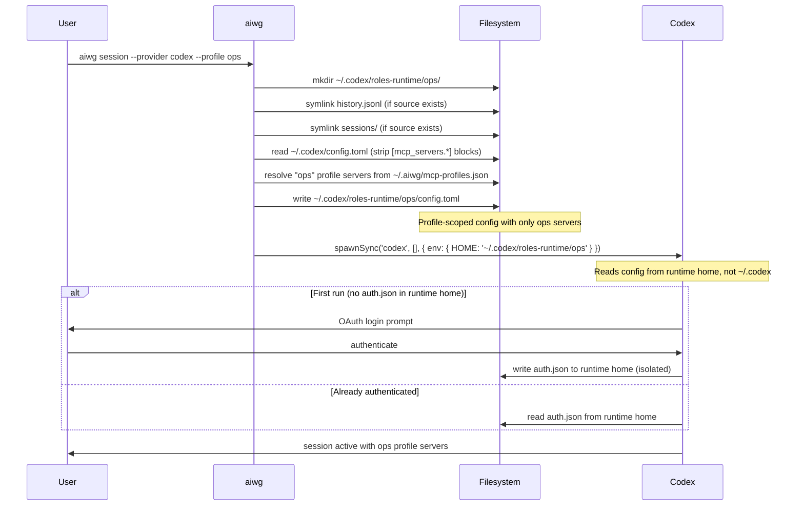

# Codex Per-Profile Runtime Homes

Codex has no native per-session config flag (unlike `claude --mcp-config`). AIWG
implements OAuth isolation per MCP profile by giving each profile its own runtime
home directory. Codex is launched with `HOME=<runtime-home>` so all config reads,
auth token writes, and OAuth flows are scoped to that profile.

This mirrors the sysops `codex-role.sh` pattern from `roctinam/sysops`.

## How It Works

```
~/.codex/                          ← global Codex home (shared)
├── history.jsonl                  ← symlinked into each runtime home
├── sessions/                      ← symlinked into each runtime home
└── roles-runtime/                 ← runtime homes live here
    ├── dev/                       ← runtime home for "dev" profile
    │   ├── config.toml            ← profile-scoped MCP server config
    │   ├── auth.json              ← OAuth tokens (isolated per profile)
    │   ├── history.jsonl  →       ← symlink to ~/.codex/history.jsonl
    │   └── sessions/      →       ← symlink to ~/.codex/sessions/
    └── ops/                       ← runtime home for "ops" profile
        ├── config.toml
        ├── auth.json
        ├── history.jsonl  →
        └── sessions/      →
```

**Isolated per profile:** `auth.json`, `.credentials`, `config.toml`  
**Shared across profiles:** `history.jsonl`, `sessions/`

## Session Flow



## Using Profile Sessions

```bash
# First run: triggers OAuth for this profile
aiwg session --provider codex --profile ops

# Subsequent runs: uses cached auth from the runtime home
aiwg session --provider codex --profile ops

# Different profile — separate auth, separate config
aiwg session --provider codex --profile dev
```

Each profile authenticates independently. Logging out of one profile does not affect
other profiles.

## Explicit Login

Run OAuth login for a profile without starting a full session:

```bash
aiwg mcp profile login ops --provider codex
```

This calls `codex login` with `HOME` set to the profile runtime home. Useful for
pre-authenticating profiles before starting a session.

## Shared State Policy

The `SharedStatePolicy` controls which files are symlinked (shared) vs isolated per
profile. The default policy:

| Item | Behavior | Reason |
|------|----------|--------|
| `history.jsonl` | Symlinked (shared) | Operator history is cross-profile |
| `sessions/` | Symlinked (shared) | Session index is cross-profile |
| `auth.json` | Isolated | OAuth tokens are profile-scoped |
| `.credentials` | Isolated | Credentials are profile-scoped |
| `config.toml` | Isolated | MCP server config is profile-scoped |

Symlinks are created only when the source exists in `~/.codex/`. If the source does
not exist, the symlink is skipped silently (the runtime home still works).

## config.toml Generation

When setting up a runtime home, AIWG:

1. Reads `~/.codex/config.toml` (if it exists)
2. Strips all `[mcp_servers.*]` sections
3. Appends profile-scoped `[mcp_servers.*]` blocks for each server in the profile

Each server block follows the Codex TOML format:

```toml
[mcp_servers.git-gitea]
command = "npx"
args = ["-y", "@gitea/mcp-server"]
env.GITEA_TOKEN = "..."
startup_timeout_sec = 10.0
tool_timeout_sec = 60.0
```

Non-MCP settings from the global config (model preferences, theme, keybindings) are
preserved.

## Runtime Home Management

```bash
# List all runtime homes
aiwg mcp profile runtimes list

# Show details for a profile
aiwg mcp profile runtimes show ops

# Remove a runtime home (deletes auth tokens)
aiwg mcp profile runtimes remove ops

# Detect orphaned runtime homes (profile deleted but runtime home remains)
aiwg mcp profile runtimes orphans
```

## Troubleshooting

### "Runtime home does not exist"

```
Error: Runtime home for profile "ops" does not exist.
Run "aiwg mcp profile add ops" or "aiwg session --provider codex --profile ops" to create it.
```

Run `aiwg session --provider codex --profile ops` once to initialize the runtime home.

### Auth tokens not persisting across sessions

Verify the runtime home was created with the correct path:

```bash
ls ~/.codex/roles-runtime/ops/auth.json
```

If missing, the OAuth flow did not complete. Re-run `aiwg session --provider codex --profile ops`.

### MCP servers not appearing in Codex

Check the generated config:

```bash
cat ~/.codex/roles-runtime/ops/config.toml
```

If empty or missing `[mcp_servers.*]` blocks, the profile may have no servers resolved.
Run `aiwg mcp profile show ops` to verify the server list.

### Cross-device symlink errors

On systems where `~/.codex/` is on a different filesystem, symlinks may fail with
`EXDEV`. AIWG suppresses this error and continues — the runtime home still works,
but history and sessions will not be shared across profiles.

## Further Reading

- [MCP Profiles](./profiles.md) — Profile registry, CRUD, and provider overrides
- [CLI Reference: mcp profile](../cli-reference.md#mcp-profile) — Full command reference
- [CLI Reference: session](../cli-reference.md#session) — Session launcher with profile support
